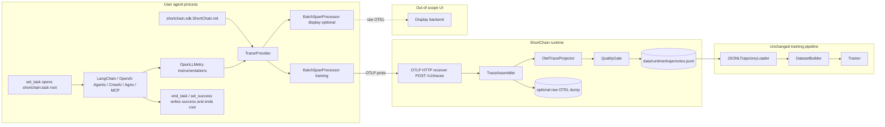
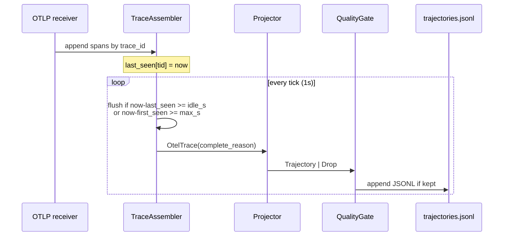
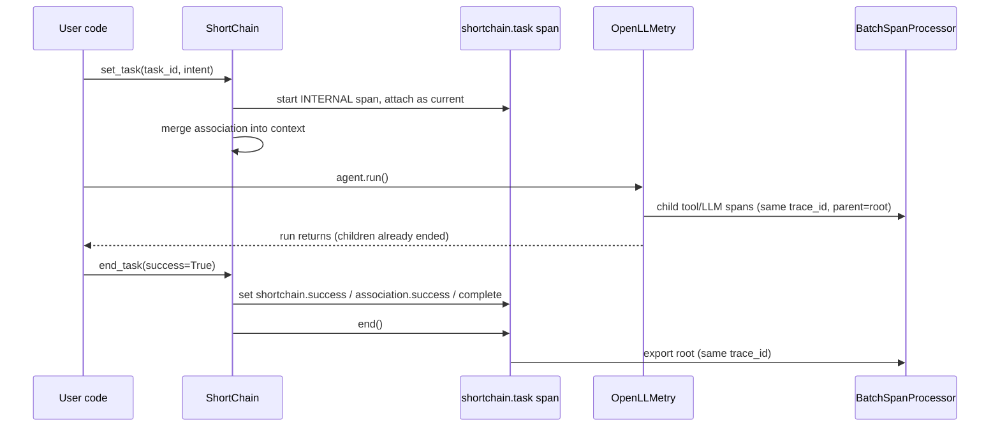
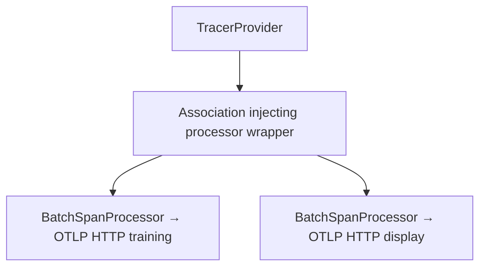

> **Implemented on `main2` (PRs 1–7 + display-endpoint hook).** This is the v1 production-collection spec that shipped: OpenLLMetry instrumentations, SDK-owned `shortchain.task` root, thin OTLP HTTP receiver, server-side projection onto `Trajectory`. Offline JSONL remains the benchmark / example path.

# Replace File-Based Production Ingest with OpenLLMetry / OpenTelemetry

| Field | Value |
|---|---|
| **Title** | OpenLLMetry production collection + OTEL → Trajectory projection |
| **Author** | ShortChain / Flavoriai engineering (draft) |
| **Date** | 2026-08-13 (rev 5) |
| **Status** | Approved-pending-implementation |
| **Audience** | Senior engineers working in `shortchain/` |
| **Related** | `docs/architecture.md`, `docs/integration.md`, `shortchain/ingest/schema.py`, `shortchain/integrations/halo.py` |

---

## Overview

ShortChain's training backbone is an ordered `Trajectory` of tool-selection decisions (`shortchain/ingest/schema.py`). Today's production-facing ingest path (`JSONLTrajectoryLoader` + `FieldMapConfig`) only works if a user dumps logs already shaped like ShortChain JSONL. That was useful for proving the pipeline (`data/example/trajectories.jsonl`, ToolBench / AppWorld / HALO adapters). It is not a real collection path.

This design replaces **production collection** with an instrumentation layer: a thin **ShortChain SDK** that enables published OpenLLMetry instrumentations and exports standard OTLP traces. A small in-repo receiver assembles traces and **projects** them onto the existing `Trajectory` / `Span` models. Offline JSONL / benchmark loaders stay. Feature extraction, pointwise reduction, group-aware splits, and `scripts/train.py` do not change.

The schema question is decided here, not left open: **`Trajectory` / `Span` remain the canonical training ontology. OTEL is an adapter input, not a new training schema.**

A later AgentOps product (Flavoriai) may display raw OTEL traces **and** consume the same projected trajectories for training. Dual-export is designed; Flavoriai UI/product is out of scope.

---

## Background & Motivation

### Current state

The training pipeline is linear and already documented in `docs/architecture.md`:

```
JSON/JSONL → JSONLTrajectoryLoader → list[Trajectory]
           → DatasetBuilder (pointwise pairs)
           → GroupStratifiedSplitter (group_by=task_id)
           → FeaturePipeline + Trainer
           → InferenceEngine.predict(context, candidates)
```

What the model actually consumes is **not** a raw observability tree. `ContextFeatureBuilder.build(traj, span_index=k)` reads only `traj.spans[:k]` (no lookahead). `DatasetBuilder.build()` emits one positive row per tool in `traj.tools_used` (task-level) or per decision in `build_span_dataset()`. Labels are grounded in **successful** traces (`IngestConfig.success_only=True` by default). `CorpusStats` is frozen on the training set. Splitter groups by `task_id`.

Those contracts are bound to `Trajectory` fields: `task_id`, `intent`, `app_name`, `success`, ordered `Span.action` / `observation` / `thoughts`.

### Why file ingest is the wrong production path

`JSONLTrajectoryLoader` (`shortchain/ingest/loader.py`) plus `FieldMapConfig` (`shortchain/config.py`) assume the user already has ShortChain-shaped records. The shipped example even uses `steps` instead of `spans` (`configs/example.yaml`, `data/example/trajectories.jsonl`). That is a **verification fixture**, not an SDK.

Real agent stacks (LangChain, OpenAI Agents, CrewAI, Agno, MCP) already emit hierarchical OpenTelemetry spans if instrumented with OpenLLMetry. Asking users to re-serialize those into ShortChain JSONL is why production collection is ineffective.

### What already works (and we must not break)

| Path | Role | Keep? |
|---|---|---|
| `shortchain/ingest/schema.py` | Canonical training models | **Yes — ontology** |
| `JSONLTrajectoryLoader` | Offline / benchmarks / tests | **Yes — adapter** |
| `shortchain/integrations/halo.py` | External span JSONL → `Trajectory` | **Yes — precedent** |
| `integrations/appworld_api.py` | Typed tool catalog | **Yes** |
| `features/*`, `dataset/*`, `head/*` | Training / inference | **Yes — untouched** |
| `docs/integration.md` JSONL walkthrough | Currently presented as *the* path | **Rewrite as offline-only** |

`halo.py` is the existence proof for this design: it groups rows by `trace_id`, extracts tool decisions, maps intent from the last LLM `llm.input_messages`, and returns `Trajectory`. OTEL/OpenLLMetry is the same pattern with a live exporter instead of a parquet/JSONL dump.

### Pain points this change addresses

1. Users will not dump ShortChain-shaped JSONL from production agents.
2. OpenLLMetry / OTLP spans are trees of mixed kinds (LLM chat, embeddings, vector DB, HTTP, tool execute, workflow, agent). Training needs an **ordered tool-decision sequence**.
3. Semantic conventions are still migrating (`llm.*` → `gen_ai.*`, attributes vs events). Coupling the training schema to that would churn the model backbone.
4. Intent, success, thoughts, `app_name`, and a stable `task_id` are **not** first-class OTEL fields. They must be extracted or set via association properties.

---

## Goals & Non-Goals

### Goals

1. Production collection via OpenLLMetry instrumentations + OTLP export, with one-line SDK init.
2. Server-side projection of assembled OTEL traces onto existing `Trajectory` / `Span`.
3. Persist projected trajectories as JSONL (and later parquet) so `scripts/build_dataset.py` / `scripts/train.py` stay unchanged.
4. Quality gates so messy runtime traces cannot poison `success_only` labels.
5. Dual-export hook: same `TracerProvider`, two exporters (training collector + optional display backend).
6. Optional extras so the core training library stays light (pandas / numpy / sklearn / xgboost / pydantic / pyyaml / rich).
7. Preserve JSONL ingest, HALO, AppWorld, and ToolBench as offline adapters.

### Non-Goals

- Flavoriai platform UI, dashboards, or product IA.
- Rewriting `ContextFeatureBuilder`, `DatasetBuilder`, or the classifier onto raw OTEL spans.
- Vendoring `openllmetry-reference/openllmetry/` (research copy only; will be removed).
- Making `traceloop-sdk` the public API or defaulting export to `https://api.traceloop.com`.
- Online / incremental training (v1 is collect → persist → existing batch train).
- Implementing a full OTEL Collector (batching, retries, tail sampling, k8s operator).
- Supporting `use_attributes=False` (events path) for training in v1.
- Cost-aware ranking features in v1 (metadata only, so a later PR can add them).
- Replacing `InferenceEngine` integration modes A/B/C (`docs/integration.md`).

---

## Key Decisions

| # | Decision | Rationale |
|---|---|---|
| K1 | **Canonical training schema stays `Trajectory` / `Span` in `shortchain/ingest/schema.py`.** Do not rewrite features onto OTEL. | Training needs an ordered tool-decision sequence. `ContextFeatureBuilder` and `DatasetBuilder` are bound to `intent`, `spans[:k]`, `tools_used`, `success`. OTEL conventions are still migrating (`MIGRATION.md` in semconv-ai). Offline loaders still need `Trajectory`. |
| K2 | **Production collection is OpenLLMetry instrumentations + OTLP.** File JSONL is no longer the production integration story. | Users already run LangChain / OpenAI / CrewAI / MCP. OpenLLMetry already emits `gen_ai.operation.name=execute_tool` (or equivalent) without code changes to the agent loop. |
| K3 | **Projection is server-side** (assembler + projector after OTLP ingest). SDK does not emit Trajectory JSON. | One projector version, framework-aware, testable with golden fixtures. Clients stay a one-line init. Dual-export can send *raw* OTEL to a display backend without forking client logic. |
| K4 | **JSONL ingest remains** for benchmarks, tests, offline dumps, and `data/example/`. | `JSONLTrajectoryLoader`, `configs/example.yaml` (`spans: "steps"`), and `tests/test_ingest.py` are the verification path. Deleting ingest would break the product. |
| K5 | **SDK owns the public API** (`shortchain.sdk.ShortChain.init`). OpenLLMetry packages are implementation dependencies. | `Traceloop.init` defaults to `https://api.traceloop.com`, prints Traceloop branding, optionally starts a Fetcher, and hard-depends on every instrumentation. That is the wrong public surface. |
| K6 | **Own `TracerProvider` + individual `XxxInstrumentor()` construction + `.instrument(tracer_provider=...)`.** Do not wrap `traceloop-sdk` in v1. Always enable `ThreadingInstrumentor`. | Same as K5. Instrumentors accept `tracer_provider` (LangChain, Agno, CrewAI, MCP, OpenAI Agents). `use_attributes` is a **constructor** kwarg on LangChain/OpenAI, not `instrument()`. Association/task-root context is `contextvars`; LangChain tools hop threads — Traceloop always instruments threading for this reason (`tracing.py`). |
| K7 | **Success and intent are association-first, auto-extract second, quality-gated.** OTEL `StatusCode` is **not** task success. Transport is K13. | `gen_ai.task.status` on LangChain `on_chain_end` / `on_tool_end` means *span finished*, not *user goal achieved*. HALO invented a soft proxy (`supervisor__complete_task`). A post-`agent.run()` `set_success` cannot write onto already-ended OpenLLMetry spans. |
| K8 | **Dual-export = one TracerProvider, two SpanProcessors** in the SDK for v1. Official OTEL Collector fan-out is later. | Fastest path that does not require users to run a collector. Same spans go to the training receiver and an optional display endpoint. |
| K9 | **Do not vendor `openllmetry-reference/`.** Depend on PyPI extras pinned to the 0.62 / semconv-ai 0.5 line. | The reference tree is research-only and will be deleted. Instrumentors `>=0.62.0,<0.63` (not `>=0.40`) so the projector can assume single-attribute `gen_ai.tool.definitions` and current constructors. |
| K10 | **Do not move `schema.py` out of `ingest/` in this project.** Reinterpret ingest as the source-adapter layer. | Path churn (`shortchain.schema`) would touch every import (`dataset/builder.py`, `features/context.py`, tests, docs) with no behavior win. Revisit only if ingest stops being the adapter home. |
| K11 | **v1 training loop is batch:** collect → `data/runtime/trajectories.jsonl` → existing `scripts/build_dataset.py` / `scripts/train.py`. | Preserves leak-free `CorpusStats`, group splits, and success-grounded labels. Incremental training is a separate design. |
| K12 | **Content tracing defaults ON** in the SDK. Events path (`use_attributes=False`) is unsupported for training. Mirror `TRACELOOP_TRACE_CONTENT`. | Without `gen_ai.input.messages` / `gen_ai.tool.call.result` we cannot extract intent or observation. OpenLLMetry instrumentors read `TRACELOOP_TRACE_CONTENT`, not `SHORTCHAIN_*`. SDK must set both. |
| K13 | **`set_task()` starts an SDK-owned INTERNAL root span that stays current until `end_task()` / `set_success()`.** That still-open span receives success, then ends. Same `trace_id` as child tool spans. Assembler treats the ended root as `explicit_complete` (plus a short settle). | OpenLLMetry ends workflow/agent/tool spans before `agent.run()` returns. Processor `on_start` cannot attach a *post-run* success flag to those spans; a new span would be a new trace. A parent `shortchain.task` span is the only OTLP-native place to write success. |
| K14 | **The generic projector accepts OpenInference attributes** (`openinference.span.kind`, `tool.name`, `input.value`, `output.value`, `llm.input_messages`) as well as `gen_ai.*` / `traceloop.*`. | Cheap; unblocks `data/traces.jsonl` as a fixture; mixed stacks exist. HALO-specific AppWorld tutorial slicing stays in `halo.py`. |
| K15 | **v1 public import is `from shortchain.sdk import ShortChain`.** Do not publish a `flavoriai` package alias in this milestone. | User decision. Flavoriai remains a later product name; an import alias can be added when that platform exists. |
| K16 | **First-milestone production ingest is the thin in-repo OTLP HTTP receiver (PR 4).** `file://` + `OtelTrajectoryLoader` are offline/dev only, not the default. | User decision. Live OTLP is what the SDK sends; file dumps stay for fixtures, reprocessing, and air-gapped debug. |

---

## Proposed Design

### High-level architecture



### Package layout (what changes, what stays)

```
shortchain/
  ingest/                      # KEEP — source-adapter layer + canonical schema
    schema.py                  # KEEP — Trajectory, Span (metadata-only extensions)
    loader.py                  # KEEP — JSONLTrajectoryLoader
    base.py                    # KEEP — TrajectoryLoader protocol
    otel.py                    # NEW  — OtelSpan/OtelTrace views + OtelTraceProjector
    quality.py                 # NEW  — drop reasons, QualityReport
  integrations/                # KEEP — halo, appworld_api, …
  runtime/                     # NEW  — production collection
    __init__.py
    sdk.py                     # ShortChain.init / set_task / set_success
    instrument.py              # own TracerProvider + instrumentor enablement
    association.py             # context keys, merge-not-replace, span injection
    task_span.py               # shortchain.task root span lifecycle (K13)
    assembler.py               # TraceAssembler (trace_id grouping + timeout)
    receiver.py                # Starlette OTLP HTTP
    catalog.py                 # merge gen_ai.tool.definitions across traces
    cli.py                     # `python -m shortchain.runtime receive`
  sdk.py                       # NEW  — re-export ShortChain for `from shortchain.sdk import ShortChain`
  features/, dataset/, head/   # UNCHANGED
```

`shortchain/sdk.py` is a one-module façade so the public import is `from shortchain.sdk import ShortChain` (K15) without making `runtime` the user-facing name. A `flavoriai` import alias is **not** shipped in v1.

### What the training pipeline actually needs

From `schema.py`, `features/context.py`, `dataset/builder.py`:

| Training field | Used by | Required? |
|---|---|---|
| `Trajectory.task_id` | `SplitterConfig.group_by`, leakage isolation | **Yes** |
| `Trajectory.intent` | TF-IDF / E5 text col; primary signal | **Yes** (quality-gated) |
| `Trajectory.app_name` | `LabelEncoder`, `tool_app_match`, hard negatives | Recommended |
| `Trajectory.success` | `IngestConfig.success_only=True` | **Yes** for default training |
| `Span.action` → `tool_name` | positives, `tool_sequence`, `previous_tools` | **Yes** (≥1 tool span) |
| `Span.observation` | `last_observation` (truncated 200), `history_summary` | Recommended |
| `Span.thoughts` | `last_thought` text encoder | Optional — already `or ""` |
| Tool catalog `{name: description}` | `ToolFeatureBuilder`, BM25/DSR | Recommended; names can be derived |
| Ordered spans | `build_span_dataset`, no-lookahead `spans[:k]` | **Yes** for span mode |

Empty `thoughts` is already first-class:

```89:89:shortchain/features/context.py
            features["last_thought"] = (last.thoughts or "") if last else ""
```

`FeaturePipeline.fit_transform` skips text columns with empty vocabulary (`_skipped_text_cols`). HALO already ships `thoughts=""`. **Quality impact:** lose the reasoning text signal; `last_observation` + `history_summary` + `intent` remain. Do not invent thoughts.

`DatasetConfig.mode` is declared (`intent` | `span`) but `scripts/build_dataset.py` always calls `DatasetBuilder.build()` (task-level, `span_index=None`). Span-level is `build_span_dataset()`. Runtime trajectories must satisfy **both** APIs: ordered tool spans with observations.

---

## Hard problem 1 — Trace → Trajectory projection

### Input model (internal, not a training schema)

`shortchain/ingest/otel.py` defines **views** over OTLP spans. These are projector inputs, never seen by `DatasetBuilder`.

```python
# shortchain/ingest/otel.py  (sketch — implement in PR 2)

from pydantic import BaseModel, Field
from typing import Any

class OtelSpan(BaseModel):
    trace_id: str                 # 32-char hex
    span_id: str                  # 16-char hex
    parent_span_id: str | None = None
    name: str
    start_time_unix_nano: int
    end_time_unix_nano: int
    status_code: str = "UNSET"    # UNSET | OK | ERROR  — NOT task success
    attributes: dict[str, Any] = Field(default_factory=dict)
    resource: dict[str, Any] = Field(default_factory=dict)
    events: list[dict[str, Any]] = Field(default_factory=list)

class OtelTrace(BaseModel):
    trace_id: str
    spans: list[OtelSpan]
    complete_reason: str = "timeout"  # timeout | idle | root_ended | explicit
```

Attribute access must treat values as possibly JSON strings (OTLP JSON + some instrumentations dump `json.dumps(...)`). Reuse the HALO helpers pattern (`_as_dict` / `_as_list` in `integrations/halo.py`).

Lookup is **first non-empty key**, never `dict.get(key, next_key)` (that would treat the next key name as a default value):

```python
def _first_attr(attrs: dict[str, Any], *keys: str) -> Any:
    """Return the first present, non-empty attribute among *keys*."""
    for key in keys:
        if key not in attrs:
            continue
        value = attrs[key]
        if value is None or value == "":
            continue
        return value
    return None
```

### Trace assembly

`shortchain/runtime/assembler.py`:



**Grouping key:** `trace_id` (hex). Do not group by `gen_ai.conversation.id` for v1 — one OTEL trace = one candidate trajectory. Multi-turn conversations that reuse a conversation id across traces become multiple trajectories (correct for `group_by=task_id` if the user sets `task_id` via `set_task`).

**Completion rules** (first match):

| Rule | Default | Meaning |
|---|---|---|
| `explicit_complete` | **on** | An ended SDK root (`name == "shortchain.task"` or `shortchain.task_root=true`) is present. Start a **settle** timer (`settle_timeout_s`, default `2`) so BatchSpanProcessor can still deliver in-flight children, then flush. `end_task()` / `set_success()` is what ends this span (K13). |
| `idle_timeout_s` | `30` | No new span for this `trace_id`. Fallback when the user never called `end_task()`. **Do not rely on this for human-in-the-loop or slow tools** — those must call `end_task()` or the 30s idle will split the trace. |
| `max_trace_age_s` | `300` | Hard cap from first span (runaway agents / forgotten `end_task`) |

v1 does **not** try to detect “all children closed” from a live span stream: OTLP batches arrive out of order, and `BatchSpanProcessor` flushes ended spans independently. The SDK root end + 2s settle is the happy-path signal; idle timeout is the safety net.

**Assembler bounds** (enforced *while buffering*, not only after project):

| Bound | Default | Behavior |
|---|---|---|
| `max_inflight_traces` | `512` | If a POST would introduce a **new** `trace_id` above the cap: first try to **evict** the oldest idle in-flight trace (flush as `max_inflight_evict`). If still at cap: **HTTP 200** + OTLP `partial_success` (`rejected_spans` = count of new-tid spans dropped; `error_message=max_inflight_traces`). Accept spans for already-buffered tids. **Do not return 429** — `OTLPSpanExporter` retries 429 and would storm the receiver. Metric `traces_rejected_inflight`. |
| `max_spans_in` | `500` | Per-trace cap on **non-protected** spans. Further non-protected spans are dropped (`spans_overflow_total`); the trace is still projected. Quality `max_spans=200` is a later *training* row cap. |
| `seen_trace_ids` LRU | `100_000` | Dedup after flush |

**Protected spans (K13):** the assembler **never drops** a span with `name == "shortchain.task"` or `shortchain.task_root=true`. That span is reserved even when `max_spans_in` is already reached (it may evict one `skip` / `other` / extra LLM row to stay near the cap). The SDK root is ended **last** (`end_task` after children); a verbose LangGraph/LangChain tree can already have hundreds of workflow/task/LLM/retriever spans before the root is exported. Dropping the 501st span if it is the task root would lose `shortchain.success` and undo K13.

Overflow still projects. Eviction order when making room for a protected span: `skip` → `other` → extra LLM → extra tool (last resort). Never evict the task root.

PR 4 test: buffer 500 noise spans, then a `shortchain.task` root with `shortchain.success=true` → flush `reason=explicit`, `success_source=association`.

**Concurrency:** one `threading.Lock` (or `asyncio.Lock` if the tick is on the event loop) around `append` and `flush`. The 1s tick and Starlette handlers share that lock. **`workers=1` is mandatory** (see receiver). Uvicorn multi-worker would split one `trace_id` across assemblers; each would flush a fragment and the LRU would drop the rest (`traces_late_span`).

**Dedup:** if a late span arrives for an already-projected `trace_id`, increment `traces_late_span` and drop (do not rewrite JSONL).

**Persistence of assembler state:** in-process only for v1. Receiver restart may drop in-flight traces (metric `traces_abandoned_on_shutdown`; best-effort flush on SIGTERM).

### Span classification

A span is assigned exactly one role. **`SKIP_OPS` is checked first** so LangChain retrievers (`gen_ai.operation.name=vector_db_retrieve` **and** `traceloop.span.kind=task`) do not become tasks-that-we-might-later-misread. Classification as `tool` is *necessary but not sufficient* to emit a ShortChain row (see name gate below).

```python
TOOL_OPS = {"execute_tool"}
LLM_OPS = {"chat", "text_completion", "completion", "llm_request"}
SKIP_OPS = {"embeddings", "vector_db_retrieve", "handoff"}
SKIP_NAMES = {"mcp_tools", "tools/list", "shortchain.task"}

def classify(span: OtelSpan) -> str:
    attrs = span.attributes
    op = _first_attr(attrs, "gen_ai.operation.name", "llm.request.type")
    kind = _first_attr(attrs, "traceloop.span.kind", "openinference.span.kind")
    kind_l = (kind or "").lower()

    if op in SKIP_OPS or kind_l in {"session", "handoff", "server"}:
        return "skip"
    if span.name in SKIP_NAMES or _first_attr(attrs, "shortchain.task_root"):
        return "root" if span.name == "shortchain.task" or _first_attr(
            attrs, "shortchain.task_root"
        ) else "skip"
    if op in TOOL_OPS:
        return "tool"
    if _first_attr(attrs, "gen_ai.tool.name", "tool.name"):
        return "tool"
    if span.name.startswith("execute_tool ") or span.name.endswith(".tool"):
        return "tool"
    if span.name.startswith("function.") and kind_l in {"tool", ""}:
        return "tool"  # OpenInference / data/traces.jsonl
    if kind_l == "tool":
        return "tool"  # name still required at emit time
    if op in LLM_OPS or kind_l == "llm":
        return "llm"
    if kind_l in {"workflow", "agent"} or op == "invoke_agent":
        return "agent"
    if kind_l == "task" or op == "execute_task":
        return "task"
    return "other"
```

**Root workflow / agent:** prefer the SDK `shortchain.task` span (K13) if present; else a span with `traceloop.span.kind in {workflow, agent}` and no classified parent of the same kind; else the span with empty `parent_span_id`; else earliest `start_time`.

**Which spans become ShortChain `Span` rows:** **named tool-execute only.** After classification, `extract_tool_name(span)` must return a non-empty bare name that is not in `SKIP_NAMES`. LLM / workflow / retriever / HTTP / catalog-listing spans are **context sources**, not decisions.

This is load-bearing. Real `data/traces.jsonl` lines named `mcp_tools` have `openinference.span.kind=TOOL` and **no** `tool.name` — they list the catalog. Emitting them would put `action="mcp_tools"` (or `""`) into `traj.spans`, polluting `history_summary` / `n_spans` even when `tools_used` skips empty `action`.

HALO already keeps only named TOOL spans (or message-stream tool calls) and drops supervisor control tools.

### Ordering

Sort tool spans by `(start_time_unix_nano, span_id)`. Parallel tool calls (OpenAI Agents `parallel_tool_calls`, LangChain fan-out) become consecutive ShortChain spans. That matches `tool_sequence` semantics (duplicates allowed) and `build_span_dataset`’s “next tool given history” framing. Do **not** collapse parallel calls into one span.

Retries: keep both calls. A failed then successful `search_emails` is two decisions.

### Field extraction (priority lists)

All extractors return the first non-empty value. JSON strings are parsed.

#### `task_id`

1. Association `traceloop.association.properties.task_id` (set by `ShortChain.set_task`)
2. `gen_ai.task.id` on root / agent span (LangChain task spans use the LangChain `run_id` — **not** a user task id; only accept if association is absent **and** user opted `accept_gen_ai_task_id=True`, default **False**)
3. `gen_ai.conversation.id` (LangGraph `thread_id`, `set_conversation_id`)
4. Hex `trace_id`

Default production: (1) else (4). Using raw `trace_id` is stable and unique; users who want joinable ids call `set_task`.

#### `intent`

1. Association `intent` / `shortchain.intent`
2. `gen_ai.task.input` on root workflow/agent (LangChain writes a JSON blob `{inputs, tags, metadata, kwargs}` — unwrap `inputs` if it is a string or `{input|question|query|messages}`)
3. First **user** message in the **earliest** LLM span:
   - `gen_ai.input.messages` (OpenLLMetry current; JSON list of `{role, parts:[{type, content}]}`)
   - `gen_ai.prompt` / indexed `gen_ai.prompt.{i}.content`
   - OpenInference `llm.input_messages` (list or `llm.input_messages.{i}.message.content`) — already handled in `halo.py`
4. `traceloop.entity.input` on the root workflow/agent span
5. Empty → **quality drop** (`missing_intent`)

Heuristic for (3): walk messages in order; take the first `role in {user, human}` whose text is non-empty. If the first user message looks like a system preamble (length > 2000 and a later shorter user message exists), prefer the **last** user message before the first tool call (HALO’s “real task” idea, without AppWorld-specific markers). Keep this as a configurable `intent_strategy: first_user | last_user_before_tools` (default `first_user`).

#### `action` / `tool_name`

1. `gen_ai.tool.name` (LangChain `on_tool_start`, OpenAI Agents `_start_function_span`, Agno `_tool_wrappers`, Traceloop `@tool`)
2. `tool.name` (OpenInference — `data/traces.jsonl`)
3. `traceloop.entity.name` when `traceloop.span.kind == tool`
4. Span name parse:
   - `execute_tool {name}` → `{name}` (LangChain)
   - `{name}.tool` → `{name}` (Agno, OpenAI Agents, MCP FastMCP, Traceloop decorator)
   - `function.{name}` → `{name}` (OpenInference)
   - `tools/call.tool` + `traceloop.entity.input.tool_name` (MCP client)

`Span.action` is set to the **bare tool name** (not `name(args)`). Arguments go in `Span.metadata["tool_arguments"]`. `Span.tool_name` then equals `action` (`split("(")[0]` remains compatible).

**Control-tool filter:** optional denylist (`ProjectionConfig.drop_tools`, default empty). HALO’s `supervisor__*` filter stays in `halo.py` only — do not silently drop production tools named `complete_task`.

**Emit gate:** if `extract_tool_name` returns empty after this list, **do not append a ShortChain `Span`**. Classified-tool + nameless → skip (catalog listing / malformed).

#### `observation`

1. `gen_ai.tool.call.result` (LangChain `on_tool_end`, OpenAI Agents `_end_function_span`)
2. `traceloop.entity.output` (Agno, MCP, Traceloop `@tool`, CrewAI task output)
3. `output.value` (OpenInference)
4. `gen_ai.task.output` on the tool span
5. Paired `tool_call_response` in a later LLM `gen_ai.input.messages` (match `id`)
6. `""`

Truncate to `max_observation_chars` (default `2000`, same as HALO). `ContextFeatureBuilder` further clips to 200 for `last_observation` and 50 for `history_summary`.

#### `thoughts` (usually missing)

Not a first-class OpenLLMetry field. Best-effort, optional:

1. Preceding sibling LLM span’s `gen_ai.output.messages` text parts (role `assistant`, `type=text`) **before** that LLM’s `tool_call` parts
2. `gen_ai.completion` / `llm.completions`
3. `""`

Never fail a trace for empty thoughts. Document the quality impact (see Training-quality).

#### `success` — **this is load-bearing**

`IngestConfig.success_only` defaults **True**. `JSONLTrajectoryLoader._load_file` drops `not traj.success`. Using OTEL `StatusCode.OK` as success would label almost every finished span as a positive **including failed tasks**.

**`False` is a present value.** `_first_attr` already returns `False` (`False` is not `None` or `""`). The extractor must **not** write `if _first_attr(attrs, "shortchain.success"):` — that treats `end_task(success=False)` as missing, sets `success_source=unknown`, and drops a known failure that `success_only=False` reprocessing should keep.

```python
def extract_success(span: OtelSpan) -> bool | None:
    """None = absent / unparseable. False = known failure. True = known success."""
    raw = _first_attr(
        span.attributes,
        "shortchain.success",
        "traceloop.association.properties.success",
    )
    return _parse_optional_bool(raw)

def _parse_optional_bool(raw: Any) -> bool | None:
    if raw is None or raw == "":
        return None
    if raw is True or raw is False:
        return raw
    if isinstance(raw, (int, float)) and raw in (0, 1):
        return bool(int(raw))
    if isinstance(raw, str):
        s = raw.strip().lower()
        if s in ("true", "1", "yes"):
            return True
        if s in ("false", "0", "no"):
            return False
    return None  # unparseable → absent (do not guess)
```

Walk the SDK root first, then any other span. `extract_success(...) is False` → `success=False`, `success_source=association`. `is True` → `success=True`, same source. `is None` on all candidates → next priority. OTLP JSON may deliver `"false"` / `0`; both must parse.

PR 2 fixture `association_success_false.json`: root with `shortchain.success=false` → `Trajectory.success is False`, `success_source="association"` (quality `require_known_success` **passes**). Default ingest `success_only=True` then filters it.

Priority:

| Priority | Source | Meaning |
|---|---|---|
| 1 | SDK root span attrs `shortchain.success` / `traceloop.association.properties.success` written by `set_success` / `end_task` **before the root is ended** (K13) | **Authoritative** |
| 2 | Same keys on any other span (association injected at `on_start` for children that started after `set_task`) | Authoritative alias |
| 3 | Root/workflow `gen_ai.task.status` ∈ {`success`, `failure`} **only if** `accept_task_status=True` (default **False**) | LangChain sets this on `on_chain_end` / `on_tool_end` to mean *span completed*, not *goal achieved* |
| 4 | User-configured heuristic (default **off**): e.g. last tool name in `success_tools` list | Escape hatch for AppWorld-like stacks |
| 5 | Unknown | Projector **must** pass `success=False` explicitly (never omit — `Trajectory.success` defaults to `True` in `schema.py`) and set `metadata["success_source"]="unknown"` |

**v1 product default:** require (1) for a trace to be eligible under `success_only=True`. Auto-extract is documented as incomplete. Helpers are part of the SDK UX, not optional footnotes.

If `end_task` / `set_success` is never called, the runtime JSONL will be empty after the quality gate / default ingest filter. That is preferable to training on unlabelled failures. Metrics must make this visible (`traces_dropped{reason=success_unknown}`).

**Poison-default guard:** `Trajectory.success: bool = True` and `JSONLTrajectoryLoader` uses `record.get(fm.success, record.get("score", True))`. The projector **always** sets `success=` from this table. The quality gate **drops** when `success_source` is missing or `"unknown"`, *even if* `success is True`. The JSONL writer always emits both `"success"` and `metadata.success_source`. A unit test must show that a projected dict with no `success` key cannot reach the training path.

OTEL `StatusCode.ERROR` is stored in `Span.metadata["otel_status"]` and is **not** mapped to `Trajectory.success`.

#### `app_name`

1. Association `app_name` (`ShortChain.init(app_name=...)` **and** `set_task(app_name=...)`)
2. Resource `service.name` (SDK sets this from `app_name`)
3. `traceloop.workflow.name`
4. `gen_ai.agent.name`
5. `""` (encoder already handles unknown / empty via `LabelEncoder` + `-1` at transform)

`ShortChain.init(app_name=)` writes `service.name`. That is the default `app_name` for every trace from that process — good enough for single-app agents.

#### `agent_name`

`gen_ai.agent.name` → `Span.agent_name` on each tool span (inherit from nearest ancestor agent span). Fallback `traceloop.entity.path` / `""`.

### Framework variance (must be in the projector, not the schema)

| Framework | Tool span name | Kind / op | Name attr | Args | Result | Catalog | Notes |
|---|---|---|---|---|---|---|---|
| **LangChain** | `execute_tool {name}` | `traceloop.span.kind=tool`, `gen_ai.operation.name=execute_tool` | `gen_ai.tool.name` | `gen_ai.tool.call.arguments` (JSON blob of `{input_str, inputs, ...}`) | `gen_ai.tool.call.result` | `gen_ai.tool.definitions` on **LLM** span | Workflow = root chain; `gen_ai.task.status=success` on end is span-level |
| **OpenAI Agents** | `{name}.tool` | same | `gen_ai.tool.name` | `gen_ai.tool.call.arguments` | `gen_ai.tool.call.result` | `gen_ai.tool.definitions` on generation/response span | Handoff spans (`kind=handoff`) are **not** tools |
| **Agno** | `{name}.tool` | `traceloop.span.kind=tool` | `gen_ai.tool.name` | `traceloop.entity.input` | `traceloop.entity.output` | `tool.description` (non-standard) | Does **not** set `gen_ai.operation.name=execute_tool` today |
| **MCP** | `{params.name}.tool` or `tools/call.tool` | `traceloop.span.kind=tool` | `traceloop.entity.name` | `traceloop.entity.input` (`{tool_name, arguments}`) | `traceloop.entity.output` (`{result}`) | `tools/list` / `mcp.tools.listed` (not a decision) | **Client + server emit two tool spans per call** (FastMCP tests). Dedup required (below). Never treat `tools/list` or nameless `mcp_tools` as a decision. |
| **CrewAI** | **no tool spans** | agent `{role}.agent`, task `{desc}.task`, `{model}.llm` | — | — | task `traceloop.entity.output` | none on tool spans | **Fallback required** (below) |
| **Traceloop `@tool`** | `{name}.tool` | `traceloop.span.kind=tool` | `gen_ai.tool.name` | `traceloop.entity.input` | `traceloop.entity.output` | — | Only if user (or we) apply decorators |
| **OpenInference / HALO dump** | `function.{name}` | `openinference.span.kind=TOOL` | `tool.name` | `input.value` | `output.value` | `mcp.tools.listed` | Already mapped in `halo.py`; projector should accept these attrs so mixed dumps work |
| **Raw OpenAI tools** | LLM span only (`chat`) | `gen_ai.operation.name=chat` | tool_call parts in `gen_ai.output.messages` | part `arguments` | later `tool_call_response` | `gen_ai.tool.definitions` / legacy `llm.request.functions` | Same fallback as CrewAI |

#### CrewAI / raw-OpenAI fallback (LLM message walk)

If `classify` finds **zero named tool spans**:

CrewAI’s `wrap_llm_call` is the only tool-call carrier. `_messages_to_otel_input` encodes **prior** `tool_calls` on later LLM *inputs*; `_response_to_otel_output` emits only a text assistant message. Walking every LLM span’s full input therefore re-emits every historical call on every subsequent turn. HALO avoids this by walking the **last** LLM message list once (`build_trajectory_from_rows`).

**Contract (must be in `crewai_llm_fallback.json`):**

1. Prefer the **latest** LLM span’s `gen_ai.input.messages` (or OpenInference `llm.input_messages`) as the conversation snapshot — HALO last-span.
2. If that snapshot is empty, walk LLM spans in start-time order but emit each `tool_call.id` **once, first-seen**. If an id is missing, key is `(name, canonical_args, first_seen_ordinal)`.
3. Pair `tool_call_response` / role `tool`|`function` by `id` / `tool_call_id`. Unpaired calls get `observation=""`.
4. Do **not** independently union `gen_ai.output.messages` tool_calls from every span with every span’s input (that is the duplication bug). Output messages on the last span may supply the *latest* assistant tool_calls that are not yet in a following input; merge those by id into the last-span snapshot only.
5. Tag `Trajectory.metadata["projection.fallback"] = "llm_tool_calls"`.
6. Fixture: two LLM turns, same `call_id` present in the second input, **expect one** ShortChain `Span`.

If this still yields zero named tools → quality drop `zero_tool_spans`.

CrewAI has no per-tool observations (only the final task `traceloop.entity.output`). Accept empty observations; optionally attach that task output to the **last** tool only (never to every tool).

#### MCP client + server twin spans

FastMCP tests expect **two** `{name}.tool` spans per invocation: client `BaseSession.send_request` and server `ToolManager.call_tool` (`packages/opentelemetry-instrumentation-mcp/tests/test_fastmcp.py`). Both have `traceloop.span.kind=tool`. Server tools are nested under `mcp.server` (`traceloop.span.kind=server`; `fastmcp_instrumentation.py`). Without dedup, `tool_sequence` / `build_span_dataset` get two positives for one decision.

**Dedup is ancestry / role, not a same-name time window.** A 2s same-name window would also collapse (1) a failed-then-retry of the same tool, (2) two parallel calls to the same tool, (3) four spans from call+retry into one decision. Retries and parallel same-name calls stay as **separate** ShortChain spans.

**Role labels** (walk `parent_span_id` via the in-trace span map):

| Role | How to detect |
|---|---|
| `mcp_server` | Self or an **ancestor** has `traceloop.span.kind == "server"` **or** `name` is / contains `mcp.server` |
| `mcp_client` | Not `mcp_server`, **and** (`name == "tools/call.tool"` **or** `mcp.method.name == "tools/call"` **or** an ancestor has `traceloop.span.kind == "session"` / name `mcp.client.session`) |
| `other` | Everything else (LangChain `execute_tool {name}`, OpenAI Agents `{name}.tool`, …). Not an MCP twin. **May** collapse with a same-name **ancestor/descendant** in pass 2. |

**Pass 1 — MCP client↔server twins (must be in fixtures):**

1. Consider only (`mcp_client`, `mcp_server`) pairs with the **same extracted tool name**.
2. Prefer a parent/child (or shared `mcp.server` / session ancestor) link if one exists.
3. Remaining unmatched same-name client/server spans: pair in **start_time order** (1st client ↔ 1st server, 2nd ↔ 2nd). This is sequence matching, **not** “any two within 2s.”
4. Each pair keeps **one** representative span. Prefer the server twin (richer `traceloop.entity.output`).
5. Unpaired client or server: keep as its own candidate.
6. Do **not** introduce `mcp_twin_window_ns`. Do **not** pair `other` with `mcp_*` in this pass (that would need ancestry — pass 2).

**Pass 2 — wrapper parent + MCP leaf (LangChain / OpenAI Agents + MCP on the same `trace_id`):**

The SDK auto-enables LangChain, OpenAI Agents, and MCP together. LangChain `on_tool_start` emits `execute_tool {name}` (`gen_ai.operation.name=execute_tool`, role `other`) and, while that span is current, MCP `BaseSession.send_request` emits `{name}.tool` (`mcp_client` if a session ancestor exists). OpenAI Agents `_start_function_span` does the same (`{name}.tool`, `execute_tool`). After pass 1 the wrapper `other` span is still there → two `tool_sequence` / `build_span_dataset` positives for one user decision. `tools_used` is a set so task-level `build()` would hide this.

After pass 1, walk remaining **named** tool-span candidates:

1. If two candidates share an extracted name **and** one is an **ancestor** of the other (`parent_span_id` chain), keep **one**. Prefer `mcp_server`, else the **innermost** (deepest descendant — usually the MCP leaf with the observation).
2. **Do not** collapse same-name **siblings** (retries and parallel same-name calls). Those share a parent but neither is an ancestor of the other.
3. Repeat until no ancestor/descendant same-name pairs remain. Then emit ShortChain `Span` rows from the survivors.

**Fixtures:**

- `mcp_tool_client_server.json` — one `add_numbers` call, two raw tool spans → **one** ShortChain span.
- `mcp_tool_two_calls.json` — two sequential `add_numbers` calls, **four** raw tool spans (2 client + 2 server) → **two** ShortChain spans (siblings; pass 2 must not collapse them).
- `langchain_mcp_wrapper.json` — LangChain `execute_tool add_numbers` parent of MCP client+server twins (three raw tool spans) → **one** ShortChain span.

`tools/list` and nameless `mcp_tools` remain `skip` via `SKIP_NAMES`.

### Projector API

**One `ProjectionConfig`**, defined in `shortchain/config.py` and imported by `ingest/otel.py`, `ingest/quality.py`, and `RuntimeConfig`. Do not redeclare it in `otel.py`.

```python
# shortchain/config.py  — single source of truth

class ProjectionConfig(BaseModel):
    intent_strategy: str = "first_user"          # first_user | last_user_before_tools
    accept_gen_ai_task_id: bool = False
    accept_task_status: bool = False
    success_tools: list[str] = []                # optional heuristic, off if empty
    drop_tools: list[str] = []
    max_observation_chars: int = 2000
    max_thought_chars: int = 2000
    require_intent: bool = True
    require_tool_spans: bool = True
    require_known_success: bool = True           # matches success_only training
    max_spans: int = 200                         # training-side cap after project
    # MCP twin-dedup is ancestry/role (see projector). No time-window field.

# shortchain/ingest/otel.py
from shortchain.config import ProjectionConfig

class ProjectionResult(BaseModel):
    trajectory: Trajectory | None
    drop_reason: str | None                      # missing_intent | zero_tool_spans | ...
    warnings: list[str] = []
    stats: dict[str, int] = {}                   # n_spans_in, n_tool, n_llm, ...

class OtelTraceProjector:
    def __init__(self, config: ProjectionConfig | None = None) -> None: ...
    def project(self, trace: OtelTrace) -> ProjectionResult: ...

class OtelTrajectoryLoader:  # TrajectoryLoader protocol — land in PR 2
    """Offline: load a file/dir of assembled OTEL JSON traces (or span JSONL) and project."""
    def load(self, path: str | Path) -> list[Trajectory]: ...
```

`OtelTrajectoryLoader` is the offline twin of the receiver (fixtures, reprocessing, `file://` dumps). It implements `TrajectoryLoader` (`shortchain/ingest/base.py`) so projection is testable **without HTTP**.

### Quality gate

`shortchain/ingest/quality.py`, applied after projection:

| Check | Default | Drop reason |
|---|---|---|
| `intent` non-empty after strip | on | `missing_intent` |
| `len(tool_sequence) >= 1` | on | `zero_tool_spans` |
| `metadata.success_source` present and ≠ `"unknown"` | on | `success_unknown` (also if the key is **missing**, even when `success is True`) |
| `success is True` | applied later by `JSONLTrajectoryLoader` / optional gate `require_success_true` (default **off** at projector; **on** at ingest) | `success_false` |
| span count ≤ `max_spans` (default 200) | on | `too_many_spans` |
| duplicate `trace_id` already written | on | `duplicate_trace` |

Always persist a sidecar metrics snapshot (see Observability). Optionally write dropped traces to `data/runtime/dropped.jsonl` with `drop_reason` for debugging (off by default; PII).

---

## Hard problem 2 — Training-quality preservation

### Success-grounded labels

`success_only=True` is load-bearing: positives are “tools used on a **successful** task.” Training on failures teaches the model the failing policy.

v1 rule:

- Runtime writer sets `Trajectory.success` only from `end_task` / `set_success` on the **still-open SDK root** (K13), or an explicit heuristic the user enabled.
- The writer always emits `"success"` and `metadata.success_source`. It **omits** `tools_used` so `Trajectory`’s validator derives the set (avoids `json.dumps` failing on `set`). If `tools_used` is emitted, it must be via `Trajectory.model_dump(mode="json")` (set → list). Loader already does `set(record["tools_used"])` when the key is present.
- `JSONLTrajectoryLoader` continues to filter `success_only`.
- `scripts/build_dataset.py` is unchanged.
- Docs tell users: wrap each task in `set_task` … `end_task(success=...)`, or they will collect raw traces but train on nothing.

Do not silently treat `StatusCode.OK` as success. Do not omit `success` and rely on the Pydantic default `True`.

### Empty thoughts

Confirmed tolerated (`last_thought` → `""`; TF-IDF column skipped if all empty). Expect a small drop in span-level quality versus AppWorld JSONL (which has rich `thoughts` in `data/example/trajectories.jsonl`). Mitigations already in the model: `last_observation`, `history_summary` (last 5 `tool→obs[:50]`), `previous_tools`.

Do not backfill thoughts from the entire LLM completion (often includes the tool-call JSON). Only assistant **text** parts before tool_calls.

### Tool catalog

`shortchain/runtime/catalog.py`:

1. Walk every LLM span’s `gen_ai.tool.definitions` (JSON array of `{name, description, parameters}` — **v0.5+ single attribute**, not `gen_ai.tool.definitions.{i}.name`).
2. Also accept legacy `llm.request.functions` indexed attrs.
3. Tool-span `gen_ai.tool.description` / `tool.description` (Agno).
4. MCP `mcp.tools.listed` / `tools/list` output.
5. Merge with user file (`--catalog path`) — user descriptions win.
6. Names seen only as calls get `description=""`.

Write `data/runtime/catalog.json` as `{tool_name: description}`. `scripts/build_dataset.py` should accept `--catalog` (PR 7) and pass it to `DatasetBuilder(tool_catalog=...)`.

Optional: map definitions → a light `ToolSpec`-shaped dict later so `ToolFeatureBuilder` schema features (`n_params`, …) work without AppWorld. v1 can store `parameters` in catalog sidecar and leave `tool_specs=None` unless we add a small converter in PR 3.

### Dedup / incomplete / retries / parallel

| Case | Policy |
|---|---|
| Duplicate `trace_id` | LRU skip |
| Incomplete (idle/max-age, no `end_task`) | Project anyway; usually `success_unknown` → dropped |
| Retries | Keep both tool spans (including same-name MCP retries) |
| Parallel tools | Keep both, order by start_time (including parallel same-name MCP) |
| MCP client+server twins | Pass 1: collapse only an ancestry/role pair (prefer server). Not a time window. |
| Framework wrapper + MCP leaf | Pass 2: same extracted name **and** ancestor/descendant → one span (prefer `mcp_server`, else innermost). **Never** collapse same-name siblings. |
| Embeddings / vector DB / HTTP | Skip as decisions |
| Handoffs | Skip as decisions; do not invent a tool named `handoff` |
| Client retries of the same OTLP batch | Receiver idempotency via `trace_id` LRU |

### Incremental vs batch

v1: **batch only**. Receiver appends Trajectory JSONL. User runs:

```bash
python scripts/build_dataset.py \
  --trajectories data/runtime/trajectories.jsonl \
  --output data/datasets/runtime \
  --config configs/runtime.yaml
python scripts/train.py --dataset data/datasets/runtime --output models/shortchain.pkl
```

Online incremental training is out of scope.

### Expected load (planning numbers)

These are design targets, not SLOs yet:

| Signal | v1 target |
|---|---|
| Ingest | ≤ 50 traces/s per **single** receiver process (`workers=1`) |
| In-flight | `max_inflight_traces=512`; worst case 512 × 500 spans × ~5 KB ≈ 1.3 GB hard ceiling (typical ≪ 100 MB) |
| Per-trace buffer | `max_spans_in=500` in assembler; quality then caps emitted rows at 200 |
| POST body | `max_body_bytes=16_777_216` (16 MiB); `Content-Encoding: gzip` accepted |
| Projection | < 20 ms/trace CPU (pure Python JSON walk) |
| Training | unchanged; 1k trajectories still seconds on XGBoost |
| Observation storage | 2 KB/span × 20 tools ≈ 40 KB/traj; 100k traj ≈ 4 GB JSONL (acceptable; **secret material**) |

---

## Hard problem 3 — SDK UX

One-line init still leaves the agent loop unchanged **except** that production training quality requires wrapping each task (K13). Init alone is enough to *collect* OTEL; `set_task`/`end_task` is what makes traces trainable.

```python
from shortchain.sdk import ShortChain

ShortChain.init(api_key="sk-...", app_name="my-agent")
# existing LangChain / OpenAI / CrewAI / MCP code still runs
```

Recommended production (this is the only UX that can put success on the same `trace_id` as the tool spans):

```python
from shortchain.sdk import ShortChain

ShortChain.init(
    api_key=os.environ["SHORTCHAIN_API_KEY"],
    app_name="support-agent",
    endpoint=os.environ.get("SHORTCHAIN_ENDPOINT", "http://127.0.0.1:4318"),
    display_endpoint=os.environ.get("SHORTCHAIN_DISPLAY_ENDPOINT"),
)

def handle_request(req):
    ShortChain.set_task(task_id=req.id, intent=req.text, app_name="support-agent")
    try:
        result = agent.run(req.text)          # OpenLLMetry children nest under the root
        ShortChain.end_task(success=bool(result.ok))
        return result
    except Exception:
        ShortChain.end_task(success=False)
        raise
```

`set_success(True)` after `agent.run()` is **defined as** writing onto the still-open SDK root and ending it (same as `end_task`). It must **not** start a new span. A call with no active task-root is a no-op + warning (`set_success_without_task`).

### Why a post-run association-only `set_success` cannot work

OpenLLMetry instrumentors end their roots before the user-facing call returns (LangChain `on_chain_end` → `_end_span`; CrewAI `wrap_kickoff` exits `crewai.workflow`; OpenAI Agents ends agent/function spans in `on_span_end`). After that, `trace.get_current_span()` is typically invalid. Traceloop’s `set_association_properties` only writes the *current* span when a workflow is still in context, and otherwise relies on `on_start` for **future** spans. A post-run flag therefore attaches to nothing. Emitting a new span at that point starts a **new** `trace_id`: the assembler sees one trace with tools + `success_unknown` and another with success + `zero_tool_spans` — both dropped under default gates.

### Task-root span lifecycle (K13)



Implementation (`shortchain/runtime/task_span.py`):

1. `set_task(...)` starts `tracer.start_span("shortchain.task", kind=INTERNAL)` with attributes:
   - `shortchain.task_root=true`
   - `traceloop.span.kind=workflow` (so existing OpenLLMetry processors treat it as a workflow)
   - `shortchain.task_id`, `shortchain.intent`, optional `shortchain.app_name`
   - `traceloop.association.properties.task_id` / `.intent` / `.app_name`
2. Attach it as the current span (`context.attach(set_span_in_context(span))`) and store `(span, token)` in a `ContextVar` (`shortchain.task_handle`). Nested `set_task` ends the previous root with `success_source=unknown` + warning (do not leak handles).
3. `set_association(**props)` **merges** into the context dict (`{**current, **props}`), never replaces. Writes new keys onto the **current** span if it is recording (the task root). Processor `on_start` copies the merged dict onto every **future** child.
4. Instrumentor children that use the current context (LangChain first workflow `start_span`, CrewAI `start_as_current_span`, Agno/MCP/OpenAI Agents) become children of `shortchain.task` → **same `trace_id`**.
5. `set_success(ok)` / `end_task(success=ok)` on the stored handle:
   - `span.set_attribute("shortchain.success", ok)`
   - `span.set_attribute("traceloop.association.properties.success", ok)`
   - `span.set_attribute("shortchain.complete", True)`
   - `span.end()`; detach token; clear the ContextVar
6. Assembler: ended `shortchain.task` → `explicit_complete` after `settle_timeout_s=2` (late children still in the batch processor).
7. `ThreadingInstrumentor().instrument()` is **always** enabled so the task handle and association survive LangChain thread-pool tools.

PR 6 golden test: `set_task` → fake child tool span (ended) → `set_success(True)` → `InMemorySpanExporter` shows the **root still carries success** on the **same** `trace_id` as the child.

### `ShortChain.init` contract

```python
# shortchain/runtime/sdk.py

from collections.abc import Callable
from opentelemetry.sdk.trace import ReadableSpan

class ShortChain:
    @staticmethod
    def init(
        *,
        api_key: str | None = None,
        app_name: str = "shortchain-app",
        endpoint: str = "http://127.0.0.1:4318",
        display_endpoint: str | None = None,
        enabled: bool = True,
        disable_batch: bool = False,
        instruments: set[str] | None = None,   # None = auto-detect installed
        block_instruments: set[str] | None = None,
        resource_attributes: dict | None = None,
        headers: dict[str, str] | None = None,
        content_tracing: bool = True,          # default ON (K12)
        span_postprocess: Callable[[ReadableSpan], None] | None = None,
    ) -> None: ...

    @staticmethod
    def set_task(
        task_id: str,
        *,
        intent: str | None = None,
        app_name: str | None = None,
        **association: str,
    ) -> None:
        """Start (or replace) the SDK task-root span and merge association."""

    @staticmethod
    def set_success(success: bool) -> None:
        """Write success on the open task root and end it. Alias of end_task."""

    @staticmethod
    def end_task(success: bool | None = None) -> None:
        """Write optional success + shortchain.complete=true and end the root."""

    @staticmethod
    def set_association(**properties: str) -> None:
        """Merge-not-replace association properties into context + current span."""

    @staticmethod
    def flush() -> None: ...
```

`span_postprocess` is part of the v1 interface (even if the default is `None`) so redaction can ship later without an API break. Implementation copies Traceloop’s `on_end` unfreeze of `_attributes._immutable` around the callback.

Env vars (SDK-owned, plus the one OpenLLMetry actually reads):

| Variable | Purpose |
|---|---|
| `SHORTCHAIN_API_KEY` | Bearer token |
| `SHORTCHAIN_ENDPOINT` | Training OTLP base (`/v1/traces` appended if missing). `file://path` enables the local JSONL span dump. |
| `SHORTCHAIN_DISPLAY_ENDPOINT` | Optional second exporter |
| `SHORTCHAIN_APP_NAME` | Resource `service.name` |
| `SHORTCHAIN_TRACING_ENABLED` | Kill switch |
| `SHORTCHAIN_TRACE_CONTENT` | Override content tracing (default true). **Also set `TRACELOOP_TRACE_CONTENT` to the same value** — instrumentors read that name. |

### Under the hood (own TracerProvider)

`shortchain/runtime/instrument.py` mirrors the *useful* parts of `traceloop/sdk/tracing/tracing.py` without the Traceloop client:

1. `Resource.create({SERVICE_NAME: app_name, **resource_attributes})`
2. `TracerProvider(resource=...)` if the global provider is still a `ProxyTracerProvider`; otherwise attach processors to the existing provider (same `init_tracer_provider` logic).
3. `OTLPSpanExporter` HTTP to `{endpoint}/v1/traces` with `Authorization: Bearer {api_key}`. `file://` → JSON-lines span exporter for offline `OtelTrajectoryLoader`.
4. `BatchSpanProcessor` (or `SimpleSpanProcessor` if `disable_batch`).
5. Optional second processor for `display_endpoint`.
6. Processor `on_start` injects the **merged** association dict as `traceloop.association.properties.{key}` **and** `shortchain.*` aliases. Prefix keeps compatibility if a user also runs OpenLLMetry elsewhere; the projector reads both.
7. **Always** `ThreadingInstrumentor().instrument()`.
8. Set `os.environ["TRACELOOP_TRACE_CONTENT"]` from `content_tracing` / `SHORTCHAIN_TRACE_CONTENT` **before** constructing instrumentors.
9. Enable instrumentors that are **installed**. **Try/import and construct each one independently** so a `TypeError` / missing extra cannot abort `ShortChain.init`. Prefer `inspect.signature` on `__init__`: pass `use_attributes=True` if that parameter exists, else `use_legacy_attributes=True` if that exists (LiteLLM 0.62). Then `.instrument(tracer_provider=provider)`. Auto list for v1: `langchain`, `openai`, `openai_agents`, `crewai`, `agno`, `mcp`, `anthropic`, `litellm`. Do **not** auto-enable `requests` / `urllib3` / `redis` (noise spans; users can opt in).
10. `atexit` / `flush()`.

**Enablement table** (`use_attributes` is a constructor argument on LangChain/OpenAI/Anthropic, **not** `instrument(use_attributes=True)`. LiteLLM 0.62 uses `use_legacy_attributes` instead.):

| Package | Constructor | `instrument(...)` | Framework floor |
|---|---|---|---|
| `opentelemetry-instrumentation-langchain` | `LangchainInstrumentor(use_attributes=True)` | `tracer_provider=tp` | `langchain-core` as required by 0.62.x |
| `opentelemetry-instrumentation-openai` | `OpenAIInstrumentor(use_attributes=True, ...)` | `tracer_provider=tp` | `openai` as required by 0.62.x |
| `opentelemetry-instrumentation-openai-agents` | `OpenAIAgentsInstrumentor(replace_existing_processors=True)` | `tracer_provider=tp` | `openai-agents>=0.2` |
| `opentelemetry-instrumentation-crewai` | `CrewAIInstrumentor()` | `tracer_provider=tp` | `crewai>=1.0.0` |
| `opentelemetry-instrumentation-agno` | `AgnoInstrumentor()` | `tracer_provider=tp` | `agno>=2` (as required by 0.62.x) |
| `opentelemetry-instrumentation-mcp` | `McpInstrumentor()` | `tracer_provider=tp` | `mcp>=1.6.0` |
| `opentelemetry-instrumentation-anthropic` | `AnthropicInstrumentor(use_attributes=True)` | `tracer_provider=tp` | as required by 0.62.x |
| `opentelemetry-instrumentation-litellm` | `LiteLLMInstrumentor(use_legacy_attributes=True)` — **0.62.3 has no `use_attributes`**; `True` is the attributes path, `False` is events | `tracer_provider=tp` | `litellm>=1.0.0` |
| `opentelemetry-instrumentation-threading` | `ThreadingInstrumentor()` | always, no provider needed | — |

`OpenAIAgentsInstrumentor(replace_existing_processors=True)` is required. The package defaults to `add_trace_processor` *alongside* the built-in OpenAI exporter (`replace_existing_processors=False`), which would leak PII traces to OpenAI even when we export to ShortChain.

Do **not** start Traceloop `Fetcher`, `ImageUploader`, or metrics/log exporters in v1.

### Why not wrap `traceloop-sdk`

`Traceloop.init` (`packages/traceloop-sdk/traceloop/sdk/__init__.py`):

- Default `api_endpoint="https://api.traceloop.com"`; refuses to start without a Traceloop API key unless a custom exporter is passed.
- Prints colorama branding; optional sync Fetcher to their control plane.
- `pyproject.toml` hard-depends on **every** instrumentation package (openai, pinecone, weaviate, …) — tens of deps we do not want on `shortchain[sdk]`.
- `use_attributes` default True — we want that, but it is a **constructor** kwarg we pass ourselves.

Wrapping with `exporter=OTLPSpanExporter(our_endpoint)` is a viable **prototype** (one weekend) but is rejected for v1 product (K6): branding, default endpoint, dep bloat, and `TRACELOOP_*` env namespace.

We still copy the *algorithm* of `default_span_processor_on_start`, `init_spans_exporter` (HTTP vs gRPC URL parsing), and the “always instrument threading” call. That is fair use of an Apache-2.0 pattern, not vendoring the repo.

### Dual-export



v1: SDK dual processor. Later: one exporter to an official OTEL Collector that fans out (file / Kafka / display). Same span payload — display backend stores raw OTEL; training path projects.

---

## Hard problem 4 — Server-side receiver

### Decision: thin in-repo OTLP HTTP receiver + assembler, not a full collector

Implementing retry queues, gRPC, TLS, tail sampling, and k8s CRDs is the OpenTelemetry Collector’s job. v1 needs:

- Accept what the SDK sends (OTLP/HTTP protobuf).
- Assemble traces.
- Project + write JSONL.

That is a **thin consumer**, ~200–400 lines.

### Protocol

| Item | v1 choice |
|---|---|
| Transport | **HTTP only** on `127.0.0.1:4318`. No TLS in-process. gRPC / HTTPS later or via a terminator / official collector |
| Path | `POST /v1/traces` (OTLP) |
| Primary codec | `application/x-protobuf` — `opentelemetry.proto.collector.trace.v1.ExportTraceServiceRequest` via `opentelemetry-proto` |
| Secondary codec | `application/json` OTLP JSON — fixtures + `curl` |
| Compression | Honor `Content-Encoding: gzip` (OTEL SDK sets this when `OTEL_EXPORTER_OTLP_COMPRESSION=gzip`) |
| Max body | `max_body_bytes=16_777_216` (16 MiB) after decompression; 413 if exceeded |
| Response | Always **HTTP 200** + `ExportTraceServiceResponse`. Happy path: empty `partial_success`. At `max_inflight` for **new** `trace_id`s: `partial_success.rejected_spans` = dropped new-tid count, `error_message=max_inflight_traces`. Existing-tid spans in the same POST are still accepted. **Never 429** — `OTLPSpanExporter` treats 429 as retryable and would storm a full assembler. |
| Auth | `Authorization: Bearer <api_key>`. No auth if `SHORTCHAIN_API_KEY` unset **and** bind is loopback. If bind ≠ loopback: **require** bearer; TLS is **not** implemented in-repo — terminate TLS in front (Caddy/nginx/collector). |
| Bind | `127.0.0.1:4318` default |
| Workers | **`workers=1` required.** CLI passes `--workers 1` to uvicorn and refuses `WEB_CONCURRENCY>1`. |

Library: **Starlette + uvicorn** (lighter than FastAPI, enough for one POST). Optional extra `shortchain[receiver]`.

Do **not** use the OTEL SDK’s `OTLPSpanExporter` in reverse; decode protobuf with `opentelemetry-proto` and map to `OtelSpan`.

### Process shape

```bash
# extra: shortchain[receiver]
python -m shortchain.runtime receive \
  --out data/runtime/trajectories.jsonl \
  --dropped data/runtime/dropped.jsonl \
  --catalog-out data/runtime/catalog.json \
  --idle-timeout 30 \
  --workers 1
```

Also a `configs/runtime.yaml` slice:

```yaml
runtime:
  bind: "127.0.0.1:4318"
  output: "data/runtime/trajectories.jsonl"
  idle_timeout_s: 30
  settle_timeout_s: 2
  max_trace_age_s: 300
  max_inflight_traces: 512
  max_spans_in: 500
  max_body_bytes: 16777216
  workers: 1
  projection: {}   # ProjectionConfig (imported, not duplicated)
```

`data/runtime/trajectories.jsonl` is **secret material** (prompts, tool args, observations). Do not commit it. Default umask / `0o600` on create. Treat it like a dump of production logs.

PR 4 tests must cover: `workers` refusal, 413 on oversize body, gzip round-trip, **200 + `partial_success`** at `max_inflight` (new tid dropped, existing tid accepted; **no 429**), assembler `max_spans_in` overflow **without dropping** a late `shortchain.task` root (500 noise then root with `shortchain.success=true` → `explicit` + association), lock-safe concurrent `append`+`flush`.

### Official collector (later / production)

Recommended collector config when operators already run OTEL:

```yaml
receivers:
  otlp:
    protocols:
      http:
        endpoint: 0.0.0.0:4318
exporters:
  otlphttp/shortchain:
    endpoint: http://shortchain-receiver:4318
  otlphttp/display:
    endpoint: ${DISPLAY_OTLP}
service:
  pipelines:
    traces:
      receivers: [otlp]
      exporters: [otlphttp/shortchain, otlphttp/display]
```

ShortChain still owns projection. The collector only fans out **raw** OTEL.

### In-process file exporter (dev convenience, not production)

`ShortChain.init(endpoint="file://data/runtime/otel-spans.jsonl")` may write OTLP-JSON span lines for local debugging. Assembler can be run offline (`OtelTrajectoryLoader`). This is **not** the production default (K16): no dual-export, no quality metrics server-side. Production v1 uses the thin OTLP HTTP receiver.

---

## Hard problem 5 — Fate of `shortchain/ingest/`

**Keep in place. Reinterpret as the source-adapter layer.**

| File | Action |
|---|---|
| `ingest/schema.py` | Keep path. Add docstring that this is the **canonical training schema**, not “the file format”. Allow extra keys in `Span.metadata` / `Trajectory.metadata` (already unrestricted dicts). Document reserved metadata keys (below). No new required fields. |
| `ingest/loader.py` | Keep. Still the offline loader `scripts/build_dataset.py` uses. |
| `ingest/base.py` | Keep protocol. New `OtelTrajectoryLoader` implements it. |
| `ingest/__init__.py` | Export projector symbols. |
| `ingest/otel.py` | **Add** — projector (training-adjacent, same layer as halo conceptually; halo stays under `integrations/` because it is AppWorld-specific). |
| `ingest/quality.py` | **Add** — reusable by receiver and offline loader. |
| `integrations/halo.py` | Keep. Do not merge into the OTEL projector (AppWorld tutorial slicing is product-specific). Optionally later call shared `_as_dict` / message-walk utilities extracted from both. |
| Docs | `docs/integration.md` § “Collect Agent Logs”: JSONL becomes **offline**. New § “Production: SDK + OTEL”. `docs/architecture.md` ingest diagram adds runtime. `docs/getting-started.md` keeps the 3-command JSONL demo. |

**Do not rename `ingest/` → `adapters/` in this project.** Cosmetic, breaks imports, not required to ship collection.

Reserved metadata keys (written by projector; ignored by features today):

```
Span.metadata:
  otel.trace_id, otel.span_id, otel.parent_span_id
  otel.start_time_unix_nano, otel.end_time_unix_nano
  otel.status_code
  gen_ai.operation.name, traceloop.span.kind
  gen_ai.provider.name, gen_ai.request.model, gen_ai.response.model
  gen_ai.usage.input_tokens, gen_ai.usage.output_tokens, gen_ai.usage.total_tokens
  tool_arguments
  projection.role            # tool | llm_fallback

Trajectory.metadata:
  source                     # "otel_openllmetry"
  otel.trace_id
  otel.n_spans_in
  projection.framework       # langchain | openai_agents | crewai | agno | mcp | mixed | unknown
  projection.fallback        # llm_tool_calls | none
  success_source             # association | task_status | heuristic | unknown
  intent_source
  gen_ai.conversation.id
  service.name
  tokens.input_sum, tokens.output_sum, tokens.total_sum   # for later cost features
```

No changes to `Span.action` / `observation` / `thoughts` types.

---

## Hard problem 6 — Dependencies

`pyproject.toml` today (core stays unchanged):

```
pandas, numpy, scikit-learn, xgboost, pydantic, pyyaml, rich
optional: embeddings = sentence-transformers
```

Add:

```toml
[project.optional-dependencies]
otel = [
  "opentelemetry-api>=1.38.0,<2",
  "opentelemetry-sdk>=1.38.0,<2",
  "opentelemetry-exporter-otlp-proto-http>=1.38.0,<2",
  "opentelemetry-proto>=1.38.0,<2",
  "opentelemetry-semantic-conventions>=0.59b0",
  "opentelemetry-semantic-conventions-ai>=0.5.1,<0.6.0",
]
sdk = [
  "shortchain[otel]",
  "opentelemetry-instrumentation-threading>=0.59b0",
  "opentelemetry-instrumentation-langchain>=0.62.0,<0.63",
  "opentelemetry-instrumentation-openai>=0.62.0,<0.63",
  "opentelemetry-instrumentation-openai-agents>=0.62.0,<0.63",
  "opentelemetry-instrumentation-crewai>=0.62.0,<0.63",
  "opentelemetry-instrumentation-agno>=0.62.0,<0.63",
  "opentelemetry-instrumentation-mcp>=0.62.0,<0.63",
  "opentelemetry-instrumentation-anthropic>=0.62.0,<0.63",
  "opentelemetry-instrumentation-litellm>=0.62.0,<0.63",
]
receiver = [
  "shortchain[otel]",
  "starlette>=0.37",
  "uvicorn>=0.27",
]
# umbrella
instrumentation = [
  "shortchain[sdk]",
  "shortchain[receiver]",
]
```

Notes:

- Pin **upper bounds** on `opentelemetry-semantic-conventions-ai` (`<0.6`) because 0.4→0.5 already broke attribute names (`MIGRATION.md`).
- Pin instrumentors to **`>=0.62.0,<0.63`**, matching the research tree (0.62.3) and that semconv-ai range. `>=0.40` would pull pre-0.5 packages that emit `llm.*` and indexed `gen_ai.tool.definitions.{i}.name` and different constructors.
- Framework floors are **not** declared in extras (user already has the agent stack). Document them: `crewai>=1.0.0`, `mcp>=1.6.0`, `openai-agents>=0.2`, `agno>=2` as required by the 0.62 instrumentors.
- Do **not** depend on `traceloop-sdk`.
- Do **not** add OpenLLMetry instrumentations to the core extra — they pull langchain/openai stacks transitively via `instruments` extras; declare them without forcing langchain itself (`opentelemetry-instrumentation-langchain` lists langchain only under `[instruments]`).
- `openllmetry-reference/` remains unreferenced by packaging.

Config addition (`shortchain/config.py`) — **one** `ProjectionConfig` (already specified under Projector API). `RuntimeConfig` embeds it; do not define a second class:

```python
class RuntimeConfig(BaseModel):
    bind: str = "127.0.0.1:4318"
    output: str = "data/runtime/trajectories.jsonl"
    idle_timeout_s: float = 30.0
    settle_timeout_s: float = 2.0
    max_trace_age_s: float = 300.0
    max_inflight_traces: int = 512
    max_spans_in: int = 500
    max_body_bytes: int = 16_777_216
    workers: int = 1
    projection: ProjectionConfig = Field(default_factory=ProjectionConfig)

class ShortChainConfig(BaseModel):
    ...
    runtime: RuntimeConfig = Field(default_factory=RuntimeConfig)
```

---

## API / Interface Changes

### Unchanged (public training API)

- `Trajectory`, `Span`, `load_trajectories`, `DatasetBuilder`, `Trainer`, `InferenceEngine`
- `scripts/build_dataset.py` / `scripts/train.py` CLI flags (plus optional `--catalog` in PR 7)

### New public API

```python
from shortchain.sdk import ShortChain
from shortchain.ingest.otel import OtelTraceProjector, OtelTrajectoryLoader, OtelTrace
```

### New CLI

```bash
python -m shortchain.runtime receive [--config configs/runtime.yaml]
```

### Docs that must change (PR 7)

- `docs/integration.md`: production path = SDK; JSONL = offline.
- `docs/architecture.md`: add runtime module; ingest described as adapters.
- `docs/overview.md`: “successful execution traces” can come from live OTEL.
- `README.md`: one-line SDK snippet; keep 3-command JSONL quickstart.
- `docs/getting-started.md`: do not replace the example JSONL walkthrough.

---

## Data Model Changes

**No breaking schema change.** `task_id: str` and `intent: str` remain required on `Trajectory`. Projector always supplies them (or drops the trace).

**`success` must be explicit.** `Trajectory.success` defaults to `True` in `schema.py`. The projector always passes `success=` from the priority table. The JSONL writer always includes `"success"` and `metadata.success_source`. Quality treats a missing `success_source` as `success_unknown` even if `success is True`. Test: a hand-built dump without those keys cannot pass the gate into `scripts/build_dataset.py`.

**Serialization:** `write_jsonl([traj.model_dump(mode="json") for traj in kept], path)`. `mode="json"` converts `tools_used: set[str]` to a list. Preferred: **omit `tools_used`** and let the loader validator derive it. Raw `json.dumps(traj.model_dump())` **raises** on `set`.

**Migration:** none. Old JSONL still loads. New JSONL is the same shape; extra keys live under `metadata` and are already preserved by `JSONLTrajectoryLoader._parse_record` (unknown top-level keys → `Trajectory.metadata`; unknown span keys → `Span.metadata`).

**Example projected record** (illustrative):

```json
{
  "task_id": "ticket-1842",
  "intent": "Refund order 9921 and email the customer",
  "app_name": "support-agent",
  "success": true,
  "spans": [
    {
      "agent_name": "SupportAgent",
      "action": "lookup_order",
      "observation": "{\"status\":\"delivered\"}",
      "thoughts": "",
      "metadata": {
        "otel.span_id": "a1b2c3d4e5f60718",
        "gen_ai.tool.name": "lookup_order",
        "tool_arguments": "{\"order_id\": 9921}"
      }
    }
  ],
  "metadata": {
    "source": "otel_openllmetry",
    "otel.trace_id": "1284243cbddd4e94a9fae290ec776f40",
    "success_source": "association",
    "projection.framework": "langchain"
  }
}
```

(`tools_used` omitted; derived on load.)

This is valid input to today’s `JSONLTrajectoryLoader` with default `FieldMapConfig` (`spans: "spans"`).

---

## Alternatives Considered

### Comparison

| | Approach | Training schema | Collection | Projection | Rewrite features? | Offline adapters | Coupling to OTEL churn |
|---|---|---|---|---|---|---|---|
| **A (chosen)** | Map OTEL → `Trajectory` | Keep | OpenLLMetry + OTLP | Server-side | No | Keep JSONL/HALO | Isolated in projector |
| B | Replace with OTEL-shaped models | Rewrite `Span` as OTEL | OpenLLMetry | None | **Yes — product rewrite** | Must re-adapt JSONL | High |
| C | Dual internal schemas | Trajectory for train; raw OTEL stored | OpenLLMetry | Server-side | No | Keep | Isolated |
| D | Client-side projection | Trajectory | SDK emits JSONL | In-process | No | Keep | Projector version-skew across clients |
| E | Wrap `traceloop-sdk` | Trajectory | `Traceloop.init(exporter=...)` | Server-side | No | Keep | Branding + dep bloat |
| F | Delete ingest | ??? | OpenLLMetry only | — | Indirect | **Breaks tests/benchmarks** | — |

**A vs C:** C is compatible with A. We **store raw OTEL optionally** (assembler dump) and **train on projected Trajectory**. v1 writes Trajectory JSONL as the training artifact; raw dump is optional (`--raw-dir`). That is A + a storage footnote, not a second ontology.

**B rejected:** `ContextFeatureBuilder`’s no-lookahead contract is `traj.spans[:k]` of **tool decisions**. An OTEL tree includes LLM, embeddings, HTTP, retriever, session, handoff. Promoting that tree to the training schema either (1) trains on noise or (2) re-implements the projector inside every feature. OpenLLMetry 0.5 already renamed dozens of attributes. HALO, AppWorld, ToolBench, and `data/example/` would all need new adapters *onto OTEL*, which is the opposite of reuse.

**D rejected for v1 (client-side projection):** every SDK version would embed projector rules; CrewAI fallback bugs would be stuck in customer processes; display backend would not receive raw OTEL unless we export twice in different schemas. Acceptable later as an air-gapped mode (`export_path=` + local `OtelTrajectoryLoader`), not the default.

**E rejected for product API** (see K6). Allowed only as a spike.

**F rejected:** ingest is the adapter layer. Deleting it deletes the ontology and the benchmark path. The useless part is *telling users JSONL is how they integrate*.

### Why A matches existing code

`integrations/halo.py::build_trajectory_from_rows` already:

- groups by `trace_id`
- prefers LLM message-stream tool calls, falls back to TOOL spans
- sets `task_id=trace_id`, `thoughts=""`, `success` via a domain heuristic
- returns `Trajectory`

The OpenLLMetry projector is that function generalized off AppWorld markers and onto `gen_ai.*` / `traceloop.*`.

---

## Security & Privacy Considerations

| Threat | Severity | Mitigation |
|---|---|---|
| Prompts, tool args, and observations contain PII / secrets (see `data/traces.jsonl`: emails, passwords, tokens) | **High** | Content tracing is required for training quality — document this. v1 transport is **HTTP on loopback**, not HTTPS. `data/runtime/trajectories.jsonl` is secret material (chmod 600; do not commit). `span_postprocess` is on the v1 `init` signature (default `None`); a regex redaction implementation can ship later without an API break. Never log raw OTLP bodies at INFO. |
| Receiver unauthenticated on a public port | **High** | Default bind `127.0.0.1`. Require bearer when bind ≠ loopback. In-repo receiver does **not** terminate TLS; put a terminator in front if exposing beyond loopback. |
| Training set of failed / malicious traces | **High** | `require_known_success` + `success_only`. |
| Prompt injection stored as `intent` | Medium | Treat intent as untrusted text; TF-IDF only; no eval. |
| Dual-export leaks traces to a third-party display SaaS | Medium | `display_endpoint` explicit opt-in. |
| Dependency on Traceloop control plane | Medium | Not used (K6). |
| Attribute value size (OTEL 64 KB typical limit) | Low | Truncate observation/thoughts; honor `OTEL_SPAN_ATTRIBUTE_VALUE_LENGTH_LIMIT` on SDK side like Traceloop `_truncate_json_if_needed`. |

Threat model: the receiver is a trusted training-data plane, not a multi-tenant SaaS in v1. Auth is a shared secret, not per-tenant RBAC.

---

## Observability

Receiver logs (structured via existing `shortchain.utils.logging.get_logger`):

- `trace_received n_spans=`
- `trace_flushed trace_id= reason=idle|max_age|explicit|max_inflight_evict`
- `trace_projected task_id= n_tools= success_source=`
- `trace_dropped reason= missing_intent|zero_tool_spans|success_unknown|duplicate_trace|too_many_spans`

Metrics (in-process counters; expose `GET /metrics` Prometheus text in the receiver, no extra dep — generate the text format by hand or skip scrape and write `data/runtime/stats.json` every 30s):

| Metric | Labels |
|---|---|
| `shortchain_otel_spans_received_total` | — |
| `shortchain_otel_traces_flushed_total` | `reason` |
| `shortchain_otel_traces_projected_total` | `framework` |
| `shortchain_otel_traces_dropped_total` | `reason` |
| `shortchain_otel_traces_inflight` | gauge |
| `shortchain_otel_late_spans_total` | — |
| `shortchain_otel_traces_rejected_inflight_total` | new-tid spans dropped via `partial_success` |
| `shortchain_otel_spans_overflow_total` | — |
| `shortchain_otel_http_413_total` | oversize body |
| `shortchain_otel_drop_rate` | computed: dropped / flushed |

**Alert (ops doc, not code):** drop_rate > 0.5 for 15 min — almost always “nobody called `set_success`” or content tracing off.

SDK: log once at init (`endpoint=`, `instruments_enabled=`, `content_tracing=`). Warn if `api_key` missing and endpoint is not localhost.

---

## Rollout Plan

1. **Internal extras:** land PRs 1–3 (schema docs, projector + `OtelTrajectoryLoader`, quality/catalog). Core `pip install shortchain` unchanged. Projection is dogfoodable offline from fixtures / `file://` dumps — **not** yet from live `set_success`.
2. **Receiver:** PR 4. OTLP path tested with fixture traces (no SDK required).
3. **SDK + task root:** PRs 5–6. PR 5 is `init` + TracerProvider (`InMemorySpanExporter`; **does not depend on the receiver**). PR 6 is the load-bearing `set_task` root span + `end_task` / `set_success`.
4. **Dogfood:** **only after PR 6.** Instrument a LangChain demo with `set_task` → `agent.run` → `end_task(success=True)`; confirm `data/runtime/trajectories.jsonl` trains with existing scripts on ≥ 50 successful traces.
5. **Docs:** PR 7 switches the *production* integration story; JSONL quickstart remains.
6. **Dual-export:** PR 8, optional `display_endpoint` (can land after PR 5, in parallel with 6–7).
7. **Rollback:** unset `SHORTCHAIN_TRACING_ENABLED` / stop receiver. Training falls back to last JSONL. Projector bugs cannot break `features/` / `head/`.

No model-format migration. No feature-flag inside XGBoost.

---

## Risks

| Risk | Sev | Mitigation |
|---|---|---|
| Users never call `end_task` / `set_success` → empty training set | **High** | K13 root span + metrics + docs. Do not weaken `success_only`. |
| Post-run `set_success` attaches to a new `trace_id` | **High** | K13: write on the still-open `shortchain.task` span, then end it. Golden test in PR 6. |
| CrewAI / raw OpenAI have no tool spans; history walk duplicates | **High** | Last-LLM-span snapshot + first-seen `tool_call.id`; fixture with two turns. |
| MCP client+server double tool spans | **High** | Prefer-server twin dedup; two-span fixture. |
| Nameless `kind=TOOL` (`mcp_tools`) becomes a decision | **High** | Emit only when `extract_tool_name` is non-empty. |
| `Trajectory.success` default `True` poisons labels | **High** | Always set `success=` + `success_source`; gate missing source. |
| `gen_ai.task.status=success` misread as task success | **High** | Default `accept_task_status=False`. |
| Semconv churn (`llm.*` / events vs attributes) | Medium | Projector accepts both families; events out of scope; pin instrumentors `>=0.62,<0.63` and `semconv-ai<0.6`. |
| Content tracing disabled → empty intent/obs | Medium | SDK default ON; mirror `TRACELOOP_TRACE_CONTENT`; drop `missing_intent`. |
| Association lost across LangChain thread pools | Medium | Always `ThreadingInstrumentor`. |
| OpenAI Agents dual-exports to OpenAI | Medium | `replace_existing_processors=True`. |
| Idle 30s splits long / HITL tasks | Medium | Document `end_task()` as required for long tasks; settle 2s on root end. |
| Uvicorn multi-worker splits traces | Medium | `workers=1` enforced. |
| HTTP 429 retry-storm from `OTLPSpanExporter` | Medium | Never 429. 200 + `partial_success` at inflight cap; evict oldest idle first. |
| Assembler overflow drops `shortchain.task` root | **High** | Root is reserved; evict skip/other/LLM first. |
| MCP time-window dedup collapses retries | **High** | Ancestry/role pairing only; two-call fixture. |
| LangChain/OpenAI wrapper + MCP leaf double-counts | **High** | Pass 2: same-name ancestor/descendant only; `langchain_mcp_wrapper.json`. |
| `if extract_success():` treats False as missing | **High** | `extract_success() -> bool \| None`; fixture `success=false`. |
| Unbounded assembler memory | Medium | `max_inflight=512`, `max_spans_in=500` (non-root), `max_body_bytes=16MiB`, gzip. |
| Catalog without descriptions weakens TF-IDF | Medium | Merge user catalog; extract `gen_ai.tool.definitions`. |
| PII in JSONL on disk | Medium | Loopback HTTP default; file is secret; `span_postprocess` hook in v1 API. |
| `trace_id` as `task_id` explodes group cardinality | Low | Document `set_task`; splitter still correct. |

---

## Open Questions

No blocking product questions remain. Schema-map vs rewrite is K1. Public import is K15. First-milestone ingest is K16. Success transport is K13. OpenInference is K14.

**Deferred (out of scope for v1, not blocking implementation):**

- Multi-tenant auth and a hosted Flavoriai collector. v1 is a single-tenant training plane (shared bearer, loopback HTTP).
- A `flavoriai` import alias, when that platform product exists.

---

## References

- `shortchain/ingest/schema.py` — `Span`, `Trajectory`, `tool_name`, `tools_used`, `tool_sequence`, `last_thought`
- `shortchain/ingest/loader.py` — `JSONLTrajectoryLoader`, `success_only`, field map
- `shortchain/ingest/base.py` — `TrajectoryLoader` protocol
- `shortchain/features/context.py` — no-lookahead `spans[:k]`
- `shortchain/features/pipeline.py` — empty-vocab skip; `last_thought` text col
- `shortchain/dataset/builder.py` — pointwise reduction, `build_span_dataset`
- `shortchain/config.py` — `IngestConfig`, `FieldMapConfig`
- `shortchain/integrations/halo.py` — external spans → `Trajectory` precedent
- `configs/example.yaml` / `data/example/trajectories.jsonl` — `steps` vs `spans`
- `docs/architecture.md`, `docs/integration.md`, `docs/overview.md`
- OpenLLMetry (research only): `openllmetry-reference/openllmetry/`
  - `packages/opentelemetry-semantic-conventions-ai/opentelemetry/semconv_ai/__init__.py`
  - `packages/opentelemetry-semantic-conventions-ai/MIGRATION.md`
  - `packages/traceloop-sdk/traceloop/sdk/__init__.py`, `tracing/tracing.py`, `decorators/`
  - `packages/opentelemetry-instrumentation-langchain/.../callback_handler.py`, `span_utils.py`
  - `packages/opentelemetry-instrumentation-openai-agents/.../_hooks.py`
  - `packages/opentelemetry-instrumentation-agno/.../_tool_wrappers.py`
  - `packages/opentelemetry-instrumentation-crewai/.../instrumentation.py`
  - `packages/opentelemetry-instrumentation-mcp/.../instrumentation.py`
- OTel GenAI semconv: https://opentelemetry.io/docs/specs/semconv/gen-ai/

---

## PR Plan

Incremental, independently reviewable PRs. Each should merge green on existing tests; new extras are unused unless installed.

### PR 1 — Canonical schema docs + reserved OTEL metadata keys

- **Title:** Document Trajectory as the training ontology; reserve OTEL provenance metadata
- **Files:** `shortchain/ingest/schema.py` (docstring + reserved-key comment), `docs/architecture.md` (ingest = adapter layer)
- **Depends on:** none
- **Description:** **Docs-only.** No behavior change. No new tests (metadata already round-trips; do not touch `test_load_example_data` / `data/example/` field map). Clarify that `Span.metadata` / `Trajectory.metadata` hold OTEL provenance (`otel.trace_id`, token counts, `success_source`). Do not add required fields. Do not move files.

### PR 2 — OTEL → Trajectory projector + golden fixtures + offline loader

- **Title:** Add `OtelTraceProjector` and `OtelTrajectoryLoader` with multi-framework golden tests
- **Files:** `shortchain/ingest/otel.py`, `shortchain/config.py` (`ProjectionConfig` only), `tests/test_otel_projector.py`, `tests/test_otel_loader.py`, `tests/fixtures/otel/{langchain_tool.json,openai_agents_tool.json,agno_tool.json,crewai_llm_fallback.json,mcp_tool.json,mcp_tool_client_server.json,mcp_tool_two_calls.json,langchain_mcp_wrapper.json,openinference_function.json,openinference_mcp_tools.json,association_success.json,association_success_false.json}`
- **Depends on:** PR 1
- **Description:** Implement `OtelSpan` / `OtelTrace` / `_first_attr` / `extract_success` / `OtelTraceProjector.project` / `OtelTrajectoryLoader.load` (file or directory of assembled OTEL JSON). Cover: classification + nameless `mcp_tools` skip; CrewAI last-span fallback (two turns, same `call_id` → one ShortChain span); MCP client+server twin → one span; **two sequential `add_numbers` (four raw spans) → two ShortChain spans**; **LangChain `execute_tool add_numbers` parent of MCP twins → one ShortChain span**; OpenInference `function.{name}`; association success on a `shortchain.task` root; **`shortchain.success=false` is known failure** (`success_source=association`); empty thoughts; parallel ordering; emit-only-if-named. Fixtures are hand-minimized. Do not import `openllmetry-reference`. No network. No HTTP.

### PR 3 — Quality gate + catalog extraction

- **Title:** Projection quality gate and tool-catalog merge
- **Files:** `shortchain/ingest/quality.py`, `shortchain/runtime/catalog.py`, `tests/test_otel_quality.py`, `tests/test_otel_catalog.py`
- **Depends on:** PR 2
- **Description:** Drop reasons (`missing_intent`, `zero_tool_spans`, `success_unknown` including **missing** `success_source` when `success is True`, `too_many_spans`). Test that a projected dict without `success`/`success_source` cannot pass the gate. Parse `gen_ai.tool.definitions` JSON array + legacy `llm.request.functions` + `mcp.tools.listed`. Merge user catalog (user wins). Writer uses `model_dump(mode="json")` and omits `tools_used`.

### PR 4 — Thin OTLP HTTP receiver + assembler + JSONL writer

- **Title:** In-repo OTLP/HTTP receiver that assembles traces and writes Trajectory JSONL
- **Files:** `shortchain/runtime/assembler.py`, `shortchain/runtime/receiver.py`, `shortchain/runtime/cli.py`, `shortchain/config.py` (`RuntimeConfig`), `configs/runtime.yaml`, `pyproject.toml` (`[receiver]` extra), `tests/test_runtime_receiver.py`, `tests/test_runtime_assembler.py`
- **Depends on:** PR 2, PR 3
- **Description:** Starlette `POST /v1/traces` (protobuf + JSON + gzip). `workers=1`. Bounds: `max_inflight`, `max_spans_in`, `max_body_bytes`. Assembler lock; **never drop** the `shortchain.task` root; explicit_complete on ended root + 2s settle; idle/max-age fallback. At inflight cap: 200 + `partial_success`, not 429. Decode → project → quality gate → append JSONL (`model_dump(mode="json")`). SIGTERM flush. Tests: TestClient, 413, partial_success at cap, gzip, reserved-root overflow, concurrent append/flush. Core extra still has no OTEL deps.

### PR 5 — SDK extra: `ShortChain.init` + own TracerProvider

- **Title:** `shortchain.sdk.ShortChain.init` enabling OpenLLMetry instrumentations and OTLP export
- **Files:** `shortchain/sdk.py`, `shortchain/runtime/sdk.py`, `shortchain/runtime/instrument.py`, `pyproject.toml` (`[otel]`, `[sdk]` extras pinned `>=0.62,<0.63`), `tests/test_sdk_init.py`
- **Depends on:** none (endpoint contract is a URL string; tests use `InMemorySpanExporter`)
- **Description:** Own `TracerProvider`; constructor kwargs per enablement table (`LiteLLMInstrumentor(use_legacy_attributes=True)` on 0.62); **try/import each instrumentor independently**; `inspect.signature` for `use_attributes` vs `use_legacy_attributes`; `instrument(tracer_provider=)`; always `ThreadingInstrumentor`; mirror `TRACELOOP_TRACE_CONTENT`; `OpenAIAgentsInstrumentor(replace_existing_processors=True)`; `span_postprocess=` hook; `file://` span dump. Assert no import of `traceloop.sdk`. Resource `service.name`. Do not require the receiver to merge.

### PR 6 — Task-root span: `set_task` / `set_success` / `end_task`

- **Title:** SDK-owned `shortchain.task` root span carries success on the same `trace_id`
- **Files:** `shortchain/runtime/task_span.py`, `shortchain/runtime/association.py`, `shortchain/runtime/sdk.py`, `tests/test_sdk_task_root.py`
- **Depends on:** PR 5
- **Description:** `set_task` starts INTERNAL root, attaches as current, merge-not-replace association. `set_success` / `end_task` write `shortchain.success` on that still-open span and end it. **Golden test:** `set_task` → fake child tool span that ends → `set_success(True)` → exporter has one `trace_id`; root has success; child is a child of the root. Warn + no-op if `set_success` is called with no open task. Document that `StatusCode` is not success.

### PR 7 — Wire `scripts/build_dataset.py` + docs to runtime trajectories

- **Title:** Accept runtime JSONL / catalog in dataset build; rewrite integration docs
- **Files:** `scripts/build_dataset.py` (`--catalog`), `docs/integration.md`, `docs/architecture.md`, `docs/overview.md`, `README.md`, `docs/getting-started.md` (additive SDK section with `set_task`/`end_task`)
- **Depends on:** PR 4 (output path), PR 3 (catalog), PR 6 (accurate SDK snippet)
- **Description:** Default field map already matches projected JSONL. Add `--catalog data/runtime/catalog.json`. Docs: production = SDK task root + OTEL; JSONL = offline/benchmarks. Keep the 15-example quickstart. Do not “fix” `data/example/` loading.

### PR 8 — Dual-export hook (second OTLP exporter)

- **Title:** Optional display-backend OTLP exporter on the same TracerProvider
- **Files:** `shortchain/runtime/instrument.py`, `shortchain/runtime/sdk.py`, `tests/test_sdk_dual_export.py`, `docs/integration.md` (one paragraph)
- **Depends on:** PR 5
- **Description:** `display_endpoint=` / `SHORTCHAIN_DISPLAY_ENDPOINT` adds a second `BatchSpanProcessor`. No Flavoriai UI. No collector YAML required (document it as an alternative).

**Suggested merge order:** 1 → 2 → 3 → 4; PR 5 in parallel with 3–4; PR 6 after 5; **dogfood after 6**; PR 7 after 4+6; PR 8 after 5 (parallel with 6–7).
