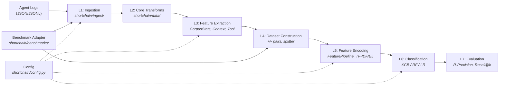
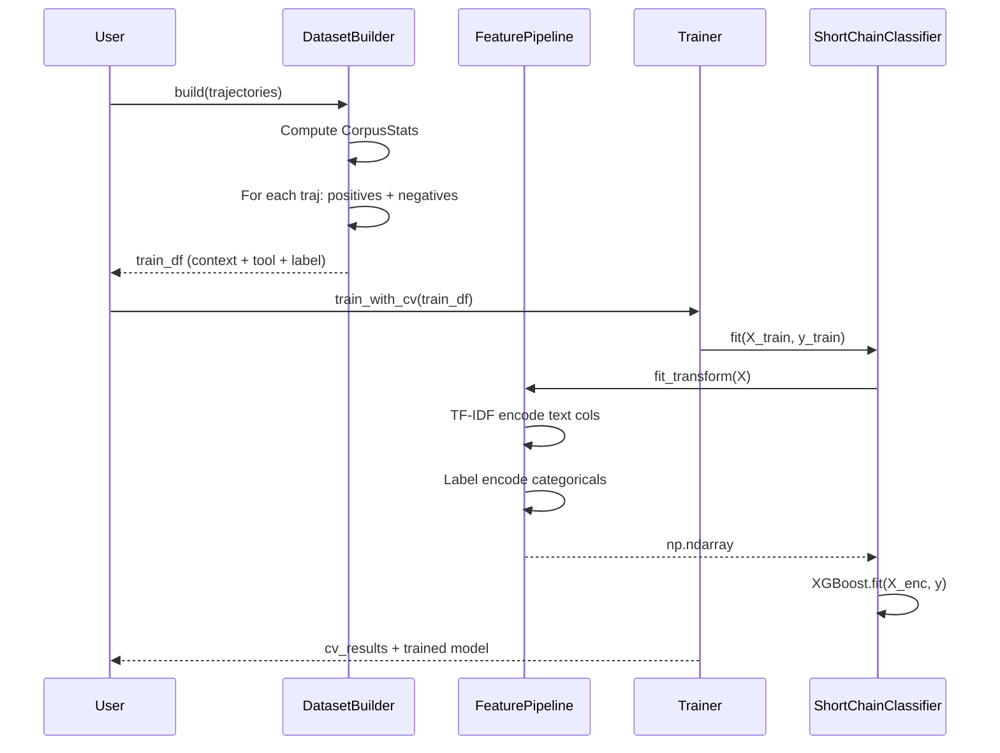

# ShortChain — Full Codebase Walkthrough

> Replace expensive LLM decision components in agentic systems with compact tabular-textual classifiers (~1ms inference vs 500–2000ms LLM calls).

**3,508 lines of Python** across 32 modules · **131 tests** · Based on [Levy et al., 2026](https://arxiv.org/abs/2602.16429)

---

## High-Level Architecture



The pipeline has **seven layers**, each cleanly separated. Data flows left-to-right through the universal `Trajectory` schema. Every module reads its config slice from the root `ShortChainConfig`.

---

## Directory Structure

```
ShortChain/                          (3,508 lines Python)
├── shortchain/
│   ├── __init__.py                     (3)   Version tag
│   ├── config.py                     (236)   11 Pydantic config models + YAML loader
│   │
│   ├── ingest/                               LAYER 1: Ingestion
│   │   ├── schema.py                  (90)   Step + Trajectory dataclasses
│   │   ├── base.py                    (28)   TrajectoryLoader protocol
│   │   └── loader.py                 (176)   JSONLTrajectoryLoader + field mapping
│   │
│   ├── data/                                 LAYER 2: Core Transforms
│   │   └── transforms.py              (83)   expand_to_step_trajectories()
│   │
│   ├── features/                             LAYER 3: Feature Extraction
│   │   ├── stats.py                   (88)   CorpusStats (frequencies, co-occurrence)
│   │   ├── context.py                (156)   ContextFeatureBuilder (state + dependency)
│   │   ├── tool.py                    (97)   ToolFeatureBuilder (corpus-enriched)
│   │   │                                     --- LAYER 5: Feature Encoding ---
│   │   ├── pipeline.py               (247)   FeaturePipeline orchestrator
│   │   └── encoders/
│   │       ├── tfidf.py               (70)   TF-IDF text encoder
│   │       └── dense.py               (87)   E5-small dense encoder (optional)
│   │
│   ├── dataset/                              LAYER 4: Dataset Construction
│   │   ├── builder.py                (200)   Pointwise (context, tool, label) pairs
│   │   ├── negatives.py              (297)   Random / Hard / Mixed negative sampling
│   │   └── splitter.py               (105)   Group-aware k-fold + train/test splits
│   │
│   ├── head/                                 LAYER 6: Classification
│   │   ├── classifier.py             (313)   ShortChainClassifier (XGB/RF/LR)
│   │   ├── trainer.py                (163)   CV training + final model
│   │   └── inference.py              (142)   InferenceEngine (production API)
│   │
│   ├── evaluation/                           LAYER 7: Evaluation
│   │   └── metrics.py                (188)   R-Precision, Recall@k, F1, AUC
│   │
│   └── utils/
│       ├── io.py                      (64)   JSON/JSONL read/write helpers
│       └── logging.py                 (71)   Rich-based structured logging
│
├── scripts/
│   ├── build_dataset.py               (95)   CLI: trajectories → dataset CSV
│   ├── train.py                      (112)   CLI: dataset → trained model
│   └── evaluate.py                   (103)   CLI: model + test set → metrics
│
├── tests/                                    100 tests, ~13s
│   ├── test_ingest.py                        Schema + loader tests
│   ├── test_dataset.py                       Builder + integration tests
│   ├── test_features.py                      Pipeline + encoder tests
│   ├── test_classifier.py                    Classifier fit/predict/save/load
│   ├── test_metrics.py                       R-precision, Recall@k
│   └── test_negatives.py                     Sampling strategies
│
└── configs/
    └── default.yaml                   (95)   Complete default configuration
```

---

## Layer-by-Layer Deep Dive

### Layer 1 — Ingestion (`shortchain/ingest/`)

**Purpose:** Load agent execution logs from any format and normalize them into the universal `Trajectory` schema.

#### [schema.py](file:///Users/awabmelayem/Downloads/ShortChain/shortchain/ingest/schema.py) — The Universal Data Model

The entire system operates on two Pydantic models:

```python
class Step(BaseModel):
    agent_name: str = ""
    action: str | None = None          # "send_email(to='x')"
    observation: str | None = None     # API response
    thoughts: str | None = None        # chain-of-thought
    metadata: dict[str, Any]

    @property
    def tool_name(self) -> str | None:  # "send_email(to='x')" → "send_email"

class Trajectory(BaseModel):
    task_id: str
    intent: str                        # "Send an email to John"
    steps: list[Step]
    success: bool = True
    app_name: str = ""
    tools_used: set[str]               # auto-derived from steps via validator
```

> [!IMPORTANT]
> `Trajectory` is the **universal contract** between all layers. Every module downstream accepts `list[Trajectory]` — no module ever sees raw JSON. This is what makes the architecture dataset-agnostic.

Key properties: `n_steps`, `tool_sequence` (ordered list with dupes), `last_thought`, `summary()`.

#### [base.py](file:///Users/awabmelayem/Downloads/ShortChain/shortchain/ingest/base.py) — Loader Protocol

```python
@runtime_checkable
class TrajectoryLoader(Protocol):
    def load(self, path: str | Path) -> list[Trajectory]: ...
```

Any data source that can produce `Trajectory` objects implements this protocol.

#### [loader.py](file:///Users/awabmelayem/Downloads/ShortChain/shortchain/ingest/loader.py) — JSONL Loader

`JSONLTrajectoryLoader` handles the common case — JSON/JSONL files with **configurable field mappings**:

```yaml
# configs/default.yaml
ingest:
  field_map:
    task_id: "task_id"      # your log's field → ShortChain's field
    intent: "intent"
    steps: "steps"
    action: "action"        # nested inside each step
```

This means you can point ShortChain at *any* agent's JSON logs and just map the fields — no code changes needed. The loader handles directory scanning, format detection, `success_only` filtering, and the `score ≥ 1.0 → success` heuristic.

---

### Layer 2 — Core Transforms (`shortchain/data/`)

#### [transforms.py](file:///Users/awabmelayem/Downloads/ShortChain/shortchain/data/transforms.py) — Step-Level Expansion

This is a **core utility** (not benchmark-specific) that expands a multi-step trajectory into per-step sub-trajectories:

```
Trajectory with steps [s0, s1, s2]
  → Sub-traj 0: steps=[s0],         tools_used={tool(s0)}
  → Sub-traj 1: steps=[s0, s1],     tools_used={tool(s1)}
  → Sub-traj 2: steps=[s0, s1, s2], tools_used={tool(s2)}
```

Each sub-trajectory gets enriched metadata: `step_index`, `total_steps`, `available_tools`, `previous_tools`. This enables **per-step decision modeling** — training the classifier to predict the right tool at each step of a multi-step plan, not just at the trajectory level.

> [!NOTE]
> This lives in `shortchain/data/` (not in any benchmark module) because step-level expansion is a core trait of multi-step agent evaluation, reusable across ToolBench, WebArena, AppWorld, etc. Benchmark adapters control *when* to invoke it.

---

### Layer 3 — Feature Extraction (`shortchain/features/stats.py`, `context.py`, `tool.py`)

**Purpose:** Define *what* features to compute from trajectories and candidate tools. These builders produce raw feature dictionaries — they do **not** encode them into numeric matrices (that's Layer 5).

#### [stats.py](file:///Users/awabmelayem/Downloads/ShortChain/shortchain/features/stats.py) — CorpusStats

A Pydantic model computed once from training trajectories. Cached and shared across all feature builders and samplers:

- `tool_frequency` — how many trajectories each tool appears in
- `co_occurrence[tool_a][tool_b]` — pairwise co-occurrence counts
- `app_tools[app_name]` — which tools belong to which app
- `app_tool_count[app_name]` — distinct tool count per app

#### [context.py](file:///Users/awabmelayem/Downloads/ShortChain/shortchain/features/context.py) — ContextFeatureBuilder

Extracts features **from the trajectory** (the "query" side of the pointwise pair):

| Feature | Type | Description |
|---|---|---|
| `task_id`, `intent`, `app_name` | text | Core identifiers |
| `n_steps` | int | Step count |
| `previous_tools` | text | Pipe-separated tool sequence |
| `last_thought` | text | Final chain-of-thought |
| `step_index` | int | Current position (state) |
| `last_action` | text | Most recent tool called |
| `last_observation` | text | Truncated last API response |
| `unique_tools_so_far` | int | Tool diversity count |
| `history_summary` | text | Compact "tool→obs" string (last 5 steps) |
| `tool_diversity` | float | `unique_tools / n_steps` |
| `app_tool_count` | int | Tools available in this app (from corpus) |

Supports both **trajectory-level** (`step_index=None`) and **step-level** extraction — the same builder works for both use cases.

#### [tool.py](file:///Users/awabmelayem/Downloads/ShortChain/shortchain/features/tool.py) — ToolFeatureBuilder

Extracts features **from the candidate tool** (the "document" side):

| Feature | Type | Description |
|---|---|---|
| `tool_name` | text | Tool identifier |
| `tool_description` | text | From catalog |
| `tool_name_length` | int | Character count |
| `has_description` | bool | Description available? |
| `tool_app_match` | bool | Tool belongs to same app as context? |
| `tool_frequency` | int | Corpus frequency |
| `tool_co_occurrence` | float | Avg co-occurrence with previous tools |

---

### Layer 4 — Dataset Construction (`shortchain/dataset/`)

**Purpose:** Transform `list[Trajectory]` into a training DataFrame of `(context, tool, label)` pointwise pairs using the feature builders from Layer 3.

#### [builder.py](file:///Users/awabmelayem/Downloads/ShortChain/shortchain/dataset/builder.py) — DatasetBuilder

The core algorithm from the ShortChain paper — **pointwise reduction**:

```
For each trajectory:
  1. For each tool ACTUALLY USED → create a row with label=1 (positive)
  2. Sample N tools NOT used    → create rows with label=0 (negative)
```

```python
builder = DatasetBuilder(
    config=cfg.dataset,
    features_config=cfg.features,
    negatives_config=cfg.negatives,
    tool_catalog={"send_email": "Send an email...", ...},
)
train_df = builder.build(trajectories)
# → DataFrame with context features, tool features, and "label" column
```

Internally it:
1. Resolves the tool catalog (explicit or derived from trajectories)
2. Computes `CorpusStats` (Layer 3)
3. Initialises `ContextFeatureBuilder` + `ToolFeatureBuilder` (Layer 3)
4. Creates positive+negative pairs per trajectory

#### [negatives.py](file:///Users/awabmelayem/Downloads/ShortChain/shortchain/dataset/negatives.py) — Negative Sampling (297 lines)

Three pluggable strategies, all behind a `NegativeSampler` base class:

| Strategy | How it works |
|---|---|
| `RandomSampler` | Uniform random from catalog \\ positives |
| `HardNegativeSampler` | Weighted mix: same-app tools (40%) + co-usage ranked (30%) + description-similar by token overlap (30%) |
| `MixedSampler` | Configurable blend of hard + random |

The `HardNegativeSampler` **precomputes** candidate pools at construction time (same-app pools, co-usage rankings, description token sets) so that `sample()` calls during dataset construction are O(1) lookups.

Factory: `create_sampler(config, catalog, corpus_stats)` dispatches by `config.strategy`.

#### [splitter.py](file:///Users/awabmelayem/Downloads/ShortChain/shortchain/dataset/splitter.py) — Group-Aware Splitting

`GroupStratifiedSplitter` wraps sklearn's `GroupKFold` / `GroupShuffleSplit` to ensure **no task-level data leakage** — all rows from the same `task_id` stay in the same split/fold.

---

### Layer 5 — Feature Encoding (`shortchain/features/pipeline.py`, `encoders/`)

**Purpose:** Transform raw feature dictionaries (from Layer 3, assembled by Layer 4) into a numeric matrix consumed by the classifier. This layer is concerned with *how* to encode, not *what* to extract.

#### [pipeline.py](file:///Users/awabmelayem/Downloads/ShortChain/shortchain/features/pipeline.py) — FeaturePipeline

The orchestrator that transforms a raw DataFrame into a numeric `np.ndarray`:

```
Text cols (intent, tool_name, etc.)     → TextEncoder (TF-IDF or E5-small)
Categorical cols (app_name)             → LabelEncoder
Numeric cols (n_steps, tool_frequency)  → passthrough (float32)
Boolean cols (has_description)          → int cast (0/1)
                                        ↓
                          np.hstack → (n_samples, n_features)
```

Column lists are defined at module level (`_TEXT_COLS`, `_NUM_COLS`, `_BOOL_COLS`, `_CAT_COLS`). Missing columns are silently skipped — the pipeline adapts to whatever features are present.

#### [encoders/](file:///Users/awabmelayem/Downloads/ShortChain/shortchain/features/encoders/__init__.py) — Text Encoding

Two backends behind a `TextEncoder` protocol:

- **`TfidfEncoder`** (default) — wraps sklearn's `TfidfVectorizer` with `sublinear_tf=True`. Sparse → dense conversion built in.
- **`DenseEncoder`** — uses `sentence-transformers` E5-small-v2 (384-dim). **Gracefully falls back to TF-IDF** if `sentence-transformers` isn't installed. Install via `pip install shortchain[embeddings]`.

Factory: `create_encoder(name="tfidf"|"e5-small"|"auto")`

---

### Layer 6 — Classification Head (`shortchain/head/`)

#### [classifier.py](file:///Users/awabmelayem/Downloads/ShortChain/shortchain/head/classifier.py) — ShortChainClassifier (313 lines)

The central model class. Wraps three sklearn-compatible backends:

| Backend | Key params |
|---|---|
| **XGBoost** (default) | 300 trees, depth 8, early stopping with 10% holdout |
| **Random Forest** | 200 trees, depth 12, `n_jobs=-1` |
| **Logistic Regression** | C=1.0, max_iter=1000 |

Key design decisions:
- **FeaturePipeline is embedded** — `fit()` creates and fits a `FeaturePipeline`, which is then used in `predict_proba()` and serialised with the model
- **XGBoost early stopping** — automatically holds out 10% for `eval_set` to prevent overfitting
- **Legacy v1 compatibility** — `load()` detects old Phase 1 pickle format (inline TF-IDF/LabelEncoder) and falls back to a compatibility adapter
- **`shortlist()`** — groups by `task_id`, ranks by score, returns top-K `(tool_name, confidence)` tuples

#### [trainer.py](file:///Users/awabmelayem/Downloads/ShortChain/shortchain/head/trainer.py) — Trainer

Orchestrates the training loop:

```python
trainer = Trainer(classifier_config, splitter_config, eval_config)

# 1. K-fold cross-validation
cv_results = trainer.train_with_cv(train_df)
# → {"fold_metrics": [...], "aggregate": {...}, "training_time_s": float}

# 2. Final model on all data
clf = trainer.train_final(train_df, save_path="models/shortchain.pkl")
```

CV uses `GroupStratifiedSplitter` to prevent leakage, and logs per-fold P@R / R@5 / F1 metrics.

#### [inference.py](file:///Users/awabmelayem/Downloads/ShortChain/shortchain/head/inference.py) — InferenceEngine

The **production API** — what you'd integrate into a real agent:

```python
engine = InferenceEngine(model_path="models/shortchain.pkl", top_k=5)

# Single context, multiple candidates (~1ms):
shortlist = engine.predict(
    context={"intent": "Send email", "app_name": "gmail", ...},
    candidates=[{"tool_name": "send_email", "tool_description": "..."}, ...],
)
# → [("send_email", 0.94), ("create_draft", 0.72), ...]

# Batch mode:
results = engine.predict_batch(df, top_k=5)
# → {"task_001": [...], "task_002": [...]}
```

---

### Layer 7 — Evaluation (`shortchain/evaluation/`)

#### [metrics.py](file:///Users/awabmelayem/Downloads/ShortChain/shortchain/evaluation/metrics.py) — Paper-Faithful Metrics

| Metric | Formula | Description |
|---|---|---|
| **R-Precision (P@R)** | `|S_R(t) ∩ G(t)| / |G(t)|` | Adapts cutoff to task's relevant-set size |
| **Recall@k** | `|S_k(t) ∩ G(t)| / |G(t)|` | Fixed-budget recovery at k ∈ {3,5,7,9} |
| **Accuracy, Precision, Recall, F1** | Standard sklearn | Binary classification metrics |
| **AUC** | `roc_auc_score` | Area under ROC curve |

All ranking metrics are **macro-averaged** across tasks (each task weighted equally regardless of candidate count).

`compute_metrics()` is the single entry point that returns all metrics as a flat dict. `format_metrics()` pretty-prints them.

---

### Adapter Layer — Benchmarks (`shortchain/benchmarks/`)

**Purpose:** Decouple benchmark-specific concerns (data format, catalog loading, failure negatives) from the core pipeline.

#### [adapter.py](file:///Users/awabmelayem/Downloads/ShortChain/shortchain/benchmarks/adapter.py) — BenchmarkAdapter Protocol

```python
@runtime_checkable
class BenchmarkAdapter(Protocol):
    name: str
    def load_catalog(self) -> dict[str, str]: ...
    def load_trajectories(self, split: str) -> list[Trajectory]: ...
    def category_map(self) -> dict[str, str]: ...
    def augment_training(self, df: pd.DataFrame) -> pd.DataFrame: ...  # default: noop
```

Every benchmark implements this. The core pipeline never sees benchmark-specific types.

---

### Configuration (`shortchain/config.py`)

**11 Pydantic models** organized hierarchically under `ShortChainConfig`:

```
ShortChainConfig
├── IngestConfig          # format, success_only, field_map
│   └── FieldMapConfig    # task_id → "task_id", intent → "intent", ...
├── FeaturesConfig        # text_encoder, e5_model_name, context_fields, ...
├── NegativeSamplingConfig # strategy, hard ratios, weights
├── DatasetConfig         # negative_ratio, legacy fields
├── SplitterConfig        # n_folds, test_size, group_by
├── ClassifierConfig      # model_type + per-backend params
│   ├── XGBoostParams
│   ├── RandomForestParams
│   └── LogisticParams
├── InferenceConfig       # top_k, confidence_threshold
├── EvaluationConfig      # k_values, metrics list
└── BenchmarkConfig       # adapter name, step_level, failure negatives
```

`load_config()` deep-merges a user YAML on top of `configs/default.yaml`, so you only need to specify overrides:

```yaml
# Only override what you need:
classifier:
  model_type: "random_forest"
negatives:
  strategy: "hard"
benchmark:
  step_level: true
```

---

### Scripts (`scripts/`)

| Script | Purpose | Usage |
|---|---|---|
| [build_dataset.py](file:///Users/awabmelayem/Downloads/ShortChain/scripts/build_dataset.py) | Trajectories → CSV dataset | `--trajectories data/ --output data/datasets/` |
| [train.py](file:///Users/awabmelayem/Downloads/ShortChain/scripts/train.py) | CSV dataset → trained model | `--dataset data/datasets/ --model xgboost` |
| [evaluate.py](file:///Users/awabmelayem/Downloads/ShortChain/scripts/evaluate.py) | Model + test CSV → metrics | `--model models/shortchain.pkl --dataset test.csv` |

These scripts are **modular** — you can run each stage independently.

---

### Tests (`tests/`)

| File | Tests | What it covers |
|---|---|---|
| `test_ingest.py` | 15 | Span tool_name parsing, Trajectory auto-derivation, JSONL loading, field mapping |
| `test_dataset.py` | 14 | DatasetBuilder pairs, positive/negative ratios, catalog derivation |
| `test_features.py` | 21 | FeaturePipeline fit/transform, TF-IDF/dense encoding, save/load roundtrip |
| `test_classifier.py` | 14 | ShortChainClassifier fit/predict, binary mode, shortlist, save/load |
| `test_metrics.py` | 8 | R-precision, Recall@k edge cases, compute_metrics integration |
| `test_negatives.py` | 14 | Random/Hard/Mixed sampling, determinism, no-overlap guarantees |
| **Total** | **86** | **~13 seconds** |

---

## Data Flow: End-to-End Example



---

## Key Design Principles

1. **Trajectory is the universal contract** — every module operates on `Trajectory` objects, never on raw JSON. This makes the system dataset-agnostic.

2. **Protocol-based extensibility** — `TrajectoryLoader`, `TextEncoder` are `@runtime_checkable Protocol`s. No ABCs, no inheritance trees.

3. **Config-driven behavior** — Pydantic models with sensible defaults. Override via YAML, no code changes needed.

4. **Zero coupling between layers** — `DatasetBuilder` knows nothing about specific benchmarks. `FeaturePipeline` knows nothing about XGBoost. `Trainer` knows nothing about trajectories.

5. **Graceful degradation** — Dense encoder falls back to TF-IDF if `sentence-transformers` isn't installed. Legacy v1 models still load. Missing feature columns are silently skipped.
